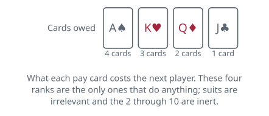

<!-- Generated by packages/build/render-markdown.ts from games/beggar-my-neighbour.json. Do not edit by hand. -->

# Beggar-My-Neighbour

**Also known as:** Beggar My Neighbor, Strip Jack Naked, Beat Your Neighbour Out of Doors, Draw the Well Dry  
**Players:** 2-4 players (best with 2)  
**Deck:** 1 standard deck (52 cards), jokers removed  
**Time:** 15-45 minutes  
**Difficulty:** Simple  
**Category:** Matching & collecting  

## Setup

One 52-card pack with the jokers taken out, two players for the standard game, and a clear patch of table between them. Shuffle and hand the pack round singly until none is left, which comes to twenty-six apiece. No card is looked at by anybody at any stage, including its owner. Square your half into a face-down stack and keep it squared.

Four ranks carry the entire game. Ace, king, queen and jack are pay cards; everything from the 2 to the 10 is an ordinary card that does nothing at all. Ordinary cards are completely interchangeable, because no card ever beats another and rank order never enters into it, and suits are ignored from the first card to the last.

Whoever shuffles deals, and the non-dealer turns the very first card of the game. Fix that between you before you shuffle rather than after, because although neither player will make a single choice all game, who starts is one of the two things — the shuffle being the other — that decides the whole result. Leave the middle clear: a single face-up pile grows there and changes hands over and over until somebody is cleaned out.

With three or four players, deal the pack round as evenly as it will go and set aside nothing — an odd card or two makes no difference to a game with no scoring in it.

## Play

Turn the top card of your stack face up into the middle and leave it there. Your opponent lays their next card on top of it, then you again, and so on. As long as only ordinary cards appear, that is the whole game: two people alternately feeding one growing pile.

A pay card interrupts it. Whoever turns one is owed cards by the other player, and the rank of the card sets the size of the debt, running from a single card for a jack up to four for an ace.

The player in debt then turns cards one at a time onto the same pile, counting them out, and one of two things happens.

- Nothing but ordinary cards comes out. The debt is discharged, and the pile belongs to the player whose pay card went unanswered. They gather up every card of it, slide the lot face down beneath their own stack, and open a fresh pile with their next card.
- A pay card comes out. Payment halts on the spot, whatever was still owed is written off, and the obligation rebounds: the other player now owes for the card just turned. Three and four rebounds in a row are ordinary, and the pile can grow enormous before anybody collects it.

Cards you win go under your stack in the order you scooped them up. The traditional game involves no shuffling whatever after the deal, which is worth knowing because it is the reason a game can run as long as it sometimes does.

Running out of cards mid-payment is the one edge case worth settling in advance. The usual reading is that you are beaten at the moment you are required to turn a card and have none. A debt is therefore paid as far as it will go: owe four, hold two, and you turn both of them, and only when the third is demanded and there is nothing to turn are you out. Play your last card as an ordinary one and you have lost; but if your last card happens to be a pay card, you are still alive, because your opponent now owes you and may fail to answer, in which case the whole pile comes across and you carry on with it. Plenty of households simplify and call a player out as soon as their stack empties.

With more than two players, the debt always falls on the next player round the table, and it keeps moving in that direction as it rebounds; a player already knocked out is skipped over. Anyone whose cards run out drops out and the rest continue, and the pile still goes to whoever played the last pay card nobody could answer — that player then opens the next pile. The last player left with cards has all fifty-two and has won.

## Goal & scoring

You win by ending up with all fifty-two cards, which happens the instant your opponent is asked to turn a card and cannot produce one. Nothing is scored, nothing is written down, and no pile is worth more than any other.

It is worth being blunt about what this game is. There are no decisions in it anywhere. You never pick which card to play, because the card you play is whichever one the shuffle left on top of your stack; you never pick whether to pay, because paying is compulsory; and since won cards go back in a fixed order and are never shuffled, everything that will happen is fixed by the deal. Two children could in principle hand the pack to an adult, be told who wins, and skip the game entirely. For a five-year-old that is precisely the appeal — all of the suspense with nothing to learn — and for anybody older it is why the novelty lasts about twenty minutes.

The same determinism makes the length wildly unpredictable, and it turned the game into a genuine mathematical curiosity. Think of the two stacks together as a single state of fifty-two cards. Every turn maps one state to exactly one next state, so if a deal ever arrives back at a state it has occupied before, it is trapped: the stretch between the two visits must now repeat, unaltered, without end. Whether any deal actually does this went unanswered for decades, and John Conway used to pose it as an anti-Hilbert problem, a question of no importance at all that nobody could crack. Searches turned up longer and longer finite games, the record standing at well over a thousand pile-collections and several thousand card turns, until a non-terminating deal was finally published in 2024.

If you want a game that certainly ends, cap it before you start: play for a fixed ten or fifteen minutes and give it to whoever holds more cards, or agree that the first player reduced below some number has lost. Counting is quick, because the two stacks always add up to fifty-two.

## Variants

**Jokers in** — Leave both jokers in the pack and rank them above the ace as pay cards worth five. Fifty-four cards deal out at twenty-seven apiece with nothing left over, and a joker turned mid-payment is the most brutal rebound in the game, since the opponent has to find five cards and any one of them can bounce it straight back. It makes the pile swing more violently without adding a single decision.

**Slapping** — Add a reflex layer: when two cards of the same rank land on top of one another, the first player to slap the pile takes it, regardless of who owes what and regardless of any payment in progress. This is the doorway to the noisier games in the same family — Slapjack and Egyptian Ratscrew both grew out of this idea — and it is the cheapest way to give Beggar-My-Neighbour something a player can actually be good at.

**Shuffling your winnings** — When you collect a pile, shuffle it before putting it under your stack instead of returning it in order. This is a house fix rather than the traditional rule, and it changes the character of the game: no deal can then cycle forever, because the order is randomised every time cards change hands, so the game ends with certainty. The price is that it destroys the mathematical curiosity that makes the game interesting to anybody over ten.

**Paying from a hand** — A rare version in which players hold their cards as a hand they can see and choose which cards to hand over when a debt falls due, rather than paying blind off the top of a stack. It supplies the only decisions the game can have — you hold your own pay cards back for when they will rebound most usefully — at the cost of the thing that makes the ordinary game usable by children who cannot yet fan a hand.

**Tags:** beginner-friendly, classic, family-friendly, kids, luck, two-player

*Rules verified against: Pagat, Wikipedia, Gamerules.com, Official Game Rules, Denexa Games, Dummies, Casella and others, A Non-Terminating Game of Beggar-My-Neighbor. This write-up is original text, not reproduced from those sources.*

---

Part of [Naibi](../README.md). Text licensed [CC BY-SA 4.0](../LICENSE).
