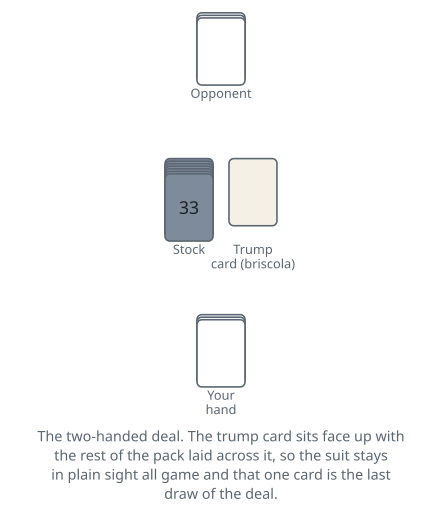
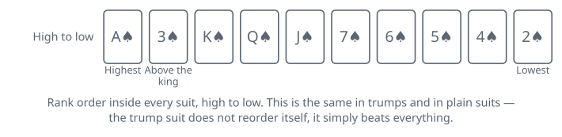

<!-- Generated by packages/build/render-markdown.ts from games/briscola.json. Do not edit by hand. -->

# Briscola

**Also known as:** Briscula, Briškula  
**Players:** 2-6 players (best with 4)  
**Deck:** 1 standard deck stripped to 40 cards (A, K, Q, J, 7, 6, 5, 4, 3, 2 in each suit)  
**Time:** 15-30 minutes  
**Difficulty:** Simple  
**Category:** Trick-taking  

## Setup

Briscola runs on forty cards. An Italian pack of coins, cups, swords and batons is ready to go as it comes; with an ordinary pack, discard the jokers and every eight, nine and ten, and you are left with exactly the same game in familiar pips. The Italian court of king, horse and jack maps onto king, queen and jack without anything changing.

Deal and play both run counter-clockwise, so cards go out to the dealer's right and the deal itself moves right after every hand. Settle the first dealer any way you like — cutting the pack and giving it to the low card is the usual method — and let the shuffled pack be cut by the player to the dealer's left before each deal. Four players is the classic form, partners facing each other across the table; two is the form everyone learns on.

Give three cards to each player, one at a time, starting with the player on the dealer's right. Turn the next card face up in the middle, then lay the rest of the pack face down across it so that a corner of it stays visible for the whole deal. That exposed card fixes the trump suit — the briscola — and it is also, as the bottom card of the pack, the very last card anybody will draw.

What has to be learned before the first trick is that the ranking follows the money rather than the pips. Only aces, threes and the three court cards carry any value at all, the pack holds 120 points between them, and 84 of those points sit in the four aces and the four threes alone. Those eight cards decide most hands, which is why they also sit at the top of the order.

Each side keeps its won tricks in a face-down pile and leaves them alone until the deal is over. Nobody counts aloud during play.

| Players | Each player gets | Removed from the deck | Notes |
| --- | --- | --- | --- |
| 2 | 3 cards | — | Thirty-four cards left in the stock; twenty tricks in the deal. |
| 3 | 3 cards | any one 2 | Thirty-nine cards, no partnerships, highest total wins. |
| 4 | 3 cards | — | Two partnerships, partners facing; ten tricks in the deal. |
| 5 | 8 cards | — | The whole pack is dealt and there is no stock: this is Briscola Chiamata, a different game. |
| 6 | 3 cards | all four 2s | Thirty-six cards, two partnerships of three, only six tricks in the deal. |

## Play

The player on the dealer's right leads to the first trick, and thereafter whoever won the last trick leads to the next.

Then comes the rule that makes Briscola what it is: there is no obligation to follow suit, ever. Whatever is led, you may answer with any card in your hand. Nobody is ever squeezed into throwing away a good card, so every trick is a free choice between spending a counter and hoarding it.

A trick is won by the highest trump played to it. If no trump appears, it goes to the highest card of the suit that was led, and cards of the two or three suits that are neither trump nor the led suit cannot win it no matter how high they rank — a discarded ace off-suit takes nothing and gives away eleven points to whoever does win. The winner turns the trick face down onto their pile.

Drawing keeps hands at three. After a trick is settled, the winner takes the top card of the stock first, and the others then draw one each in turn, continuing counter-clockwise from the winner. At every player count that uses a stock the remainder divides evenly, so nobody is ever left short at the end — the draws run out for everybody on the same round. Because the trump card lies at the bottom, it is the last card to leave the stock, and it goes to whichever player happens to draw last on that final round — in the two-handed game, the loser of that trick. From then on nothing is replaced, so every deal ends with three drawless tricks in which the whole remaining pack is, in principle, knowable. Counting what has already gone is where the game stops being luck.

The hand ends when everybody has run out of cards.

Partnerships. Most Italian tables let partners help each other along, either by talking in the vaguest possible terms or through an agreed set of signals — segni — flashed with the face and shoulders when the opponents are not looking. Sticking your tongue out or twitching a shoulder announces a specific high card to your partner. Clubs and tournaments ban all of it, so decide before the first deal which kind of table you are at.

At five players the arithmetic stops working and the game turns into a different one, in which the whole pack is dealt out, there is no stock, and the trump suit is settled by auction.

## Goal & scoring

The object is to capture point cards in tricks. When the last trick is over, each side gathers everything it won and adds up the values, and the totals must come to 120 between them — if they do not, a card has gone astray and the count has to be done again. That figure holds at three and six players as well, because the twos pulled out to make the pack divide are worth nothing.

Sixty-one takes the deal. There is no bonus for taking more, and the winner of a deal wins it exactly as much with 61 as with 120. A dead-level 60 apiece is a draw and neither side gets anything for it.

One deal is a short game, so tables usually play a match: best of three deals, or best of five, with a drawn deal counted to nobody and replayed. Some groups instead keep a running tally of deals won and stop at an agreed figure. At three players, where there are no partnerships, the highest of the three totals takes the deal — 61 is not needed and often not reached, since the same 120 is split three ways. If the two leading totals are level the deal counts to nobody and is played again, exactly as a 60-all draw is.

Because at two, four and six players 61 is the only threshold, the endgame is not about squeezing out extra points but about knowing when you are already safe. Once your pile is past 60 you can afford to throw the rest away, and a good player who is behind will hold aces back rather than spend them on tricks that do not close the gap.

| Scores | Value | Notes |
| --- | --- | --- |
| Each ace | 11 | — |
| Each three | 10 | — |
| Each king | 4 | — |
| Each queen (horse) | 3 | — |
| Each jack | 2 | — |
| Seven, six, five, four, two | 0 | twenty worthless cards, called scartini; the three is not one of them |
| Whole pack | 120 | 61 wins the deal, 60 apiece is a draw |

## Variants

**Briscola Chiamata** — The five-handed game, also met as Briscola Bastarda or Briscolone. All forty cards are dealt out, eight each, with no stock and no turned trump. Players bid the number of card points they undertake to make, and the winner of the auction names a card — usually an ace, or the highest card of a suit they are missing. Whoever holds it becomes their partner without saying so, and the suit named becomes trump. The alliance stays secret until the called card actually hits the table, so for the first few tricks nobody is sure who they are helping. The caller's side must reach 61; failing pays out to the other three.

**Briscola Scoperta** — Open Briscola. Every hand is dealt face up and the stock is turned so that the next card to be drawn is visible too. All the hidden information disappears and the game becomes a pure calculation exercise, which makes it excellent for teaching a beginner what the discards are actually costing them.

**Briscolone** — A two-handed version with five-card hands instead of three and no trump suit at all, so a trick always goes to the higher card of the suit led. Losing the trump removes the game's escape hatch: an ace led is safe, and there is no way to steal a fat trick with a low card of a favoured suit. Confusingly the same name is also used in places for the five-handed calling game.

**Brisca and the drawless-ending obligation** — Brisca is the same game in Spain and plays identically through the drawing phase, but many Spanish tables add a restriction for the tricks played after the stock is gone: once nobody is drawing any more, you must follow suit if you hold the suit led, and some go further and require you to beat the card in front if you can. It changes the last three tricks completely, since the hoarded ace can no longer be sat on. Italian Briscola imposes nothing at any stage, so this is exactly the sort of thing to establish before the first card rather than during the count.

**Silent table** — The tournament convention, worth naming because so many casual games do the opposite. Partners may not talk about their cards, signal, or comment on the trick in progress, and the only information passing across the table is which cards get played and when. Groups used to signalling find the partnership game much harder this way, since a lead has to carry the message on its own.

**Tags:** classic, counting, family-friendly, partnership, quick, strategy, two-player

*Rules verified against: Pagat, Wikipedia, Board Game Arena, Denexa Games, Gambiter, Official Game Rules. This write-up is original text, not reproduced from those sources.*

---

Part of [Naibi](../README.md). Text licensed [CC BY-SA 4.0](../LICENSE).
