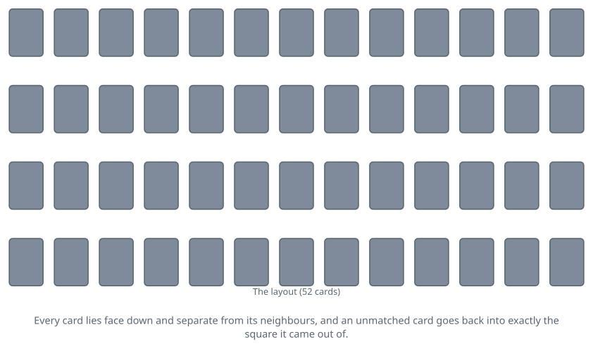

<!-- Generated by packages/build/render-markdown.ts from games/concentration.json. Do not edit by hand. -->

# Concentration

**Also known as:** Memory, Pelmanism, Pairs, Match Match, Pexeso, Shinkei-suijaku  
**Players:** 2-8 players (best with 3)  
**Deck:** 1 standard deck (52 cards)  
**Time:** 10-20 minutes  
**Difficulty:** Simple  
**Category:** Matching & collecting  

## Setup

Two or more can play and three or four is the sweet spot; beyond that the wait between turns gets long for the young players the game is usually aimed at. What you really need is a large flat surface, because the layout is the game and a cramped one ruins it.

Shuffle a full 52-card pack thoroughly, then lay every card face down in four rows of thirteen. Leave a small gap on all sides of each card so that no card overlaps another and so that a card can be turned up and set back down in precisely the square it came from. A tidy grid is not decoration: everybody at the table is memorising positions, and a layout that drifts as it is played robs whoever has been paying the closest attention.

Settle what counts as a match before the first card is turned, because traditions genuinely differ here. This entry assumes rank alone, so any two sixes go together and suits are ignored. The stricter form requires rank and colour to agree, which gives every card exactly one partner in the pack.

For small children, lay a smaller grid instead: keep the twos through the sevens and put the other seven ranks aside, which leaves 24 cards for four rows of six. Choose a starting player however you like, and play moves to the left.

## Play

On your turn, pick two cards from the layout and turn them face up where they lie, one after the other. Turn them so the whole table sees them rather than shielding them toward yourself; hiding a card you have exposed is the one thing that genuinely breaks the game, because everyone is entitled to the information a turn produces.

If the two cards match, take them, stack them in front of you, and turn two more. A run continues as long as you keep matching, and a player with a good memory routinely clears six or eight cards on one turn once the layout has been picked over a few times.

If they do not match, leave them face up long enough for everyone to have actually looked, then turn both back down without shifting them a hair from where they sat. The turn then passes to the left. The gaps left by cards that have been won stay open for the rest of the game: never close the layout up or slide the survivors together to tidy it, since the empty squares are part of what everyone is memorising. Watch for a grid that is being squared up, nudged or slid, whether or not anyone means anything by it, because a card's position is worth exactly as much as its rank.

Picking the first of your two cards is where the game is won. When you already know where the partner of some face-down card is, turn that known card first and go straight to its partner. When you know nothing useful, turn a card you have never seen before, learn what it is, and only then choose your second card from among the ones you already know. Turning two complete unknowns is right for the opening couple of turns and essentially never again, because a wasted turn spent looking at two cards you cannot use is a turn spent handing information to the player after you.

Play carries on round the table until the last card has been taken. Nobody can ever be stuck: any two face-down cards make a legal turn.

## Goal & scoring

You are collecting pairs, and the player holding the most when the layout is empty wins. Matching by rank alone, a full pack yields 26 pairs, so two players can genuinely tie at thirteen each; replay the deal or share the win, whichever the table prefers.

Count pairs rather than cards, and count at the end rather than as you go, so that nobody spends a turn totting up other people's stacks. Any of the usual session shapes fit: play three deals and add the totals, or set a target such as forty pairs and play as many deals as it takes to get there.

Once the cards are down, very little about the result is luck. The shuffle decides which blind turn happens to strike a pair, and that is the whole of it: every card is on the table and every card turned up is public, so the player who watches other people's turns as attentively as their own beats the one who only concentrates when it is their go. That is the reason this game gets handed to children so often. It rewards a single habit, and it rewards it immediately.

## Variants

**Rank and colour** — A match must agree in rank and in colour, so the six of hearts pairs only with the six of diamonds and the queen of clubs only with the queen of spades. Every card now has exactly one partner anywhere in the pack, which removes the accidental matches that the rank-only game throws up and makes remembering a card genuinely useful rather than approximately useful. Many references treat this, not rank alone, as the standard rule.

**Two packs** — Lay out 104 cards for a much longer and more punishing game. The kindest form uses two packs with different backs, shuffled separately and dealt into alternating positions like a chequerboard, so a red-backed card can only ever be matched with a blue-backed one. That halves the number of candidates you have to hold in your head and makes an otherwise unmanageable layout playable.

**Solitaire Concentration** — Lay out the grid and play alone against your own record. Turn two cards at a time under the usual rules and keep count of how many turns you needed to clear the whole layout, or of how many turns failed to produce a pair. Fewer is better, and the running total is a surprisingly precise measure of how much attention you were actually paying.

**Quartets** — Hunt for all four cards of a rank instead of two. A turn continues while every card you expose agrees with the ones already up, and ends the moment one does not, at which point all of them go back down where they came from. Expose all four and you take the set and start a fresh turn. Thirteen sets rather than 26 pairs means far fewer scores and much longer memory chains, and it is a good way to make the game interesting for adults.

**Fancy layouts** — Nothing requires a rectangle. Circles, triangles, spirals and diamond shapes are all traditional, and the dealer picks. They are harder than they look: a grid gives every card an implicit row and column to hang the memory on, and an irregular shape takes that scaffolding away, so the same 52 cards become considerably more difficult to track.

**Tags:** beginner-friendly, classic, family-friendly, kids, memory, quick, two-player

*Rules verified against: Pagat, Wikipedia, Gambiter, Game Rules, Classic Games and Puzzles, Card Game Database Wiki. This write-up is original text, not reproduced from those sources.*

---

Part of [Naibi](../README.md). Text licensed [CC BY-SA 4.0](../LICENSE).
