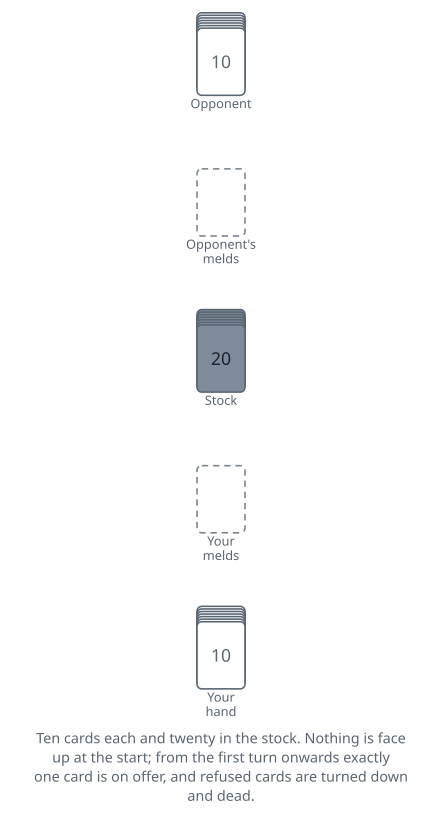
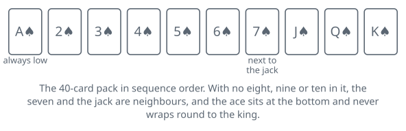
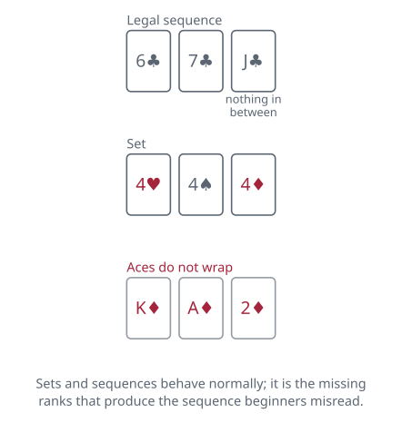

<!-- Generated by packages/build/render-markdown.ts from games/conquian.json. Do not edit by hand. -->

# Conquian

**Also known as:** Conquián, Coon Can, Cooncan, Colonel  
**Players:** 2 players  
**Deck:** 1 standard deck stripped to 40 cards (A to 7 plus J, Q, K in each suit)  
**Time:** 15-25 minutes  
**Difficulty:** Medium  
**Category:** Rummy family  

## Setup

Conquian is the oldest game in the rummy family that anyone can still put a name to. It was being played in Mexico by the middle of the nineteenth century, crossed into the English-speaking United States as Coon Can in the 1880s, and card historians — David Parlett among them — treat it as the root that every western rummy game grew out of. Playing it feels like reading a first draft of Gin Rummy, with the drawing and the hoarding not yet invented.

Two players, forty cards. A Spanish pack works exactly as it comes. From an ordinary deck, take out the jokers and every eight, nine and ten, which leaves ace through seven plus jack, queen and king in each suit. That gap is not cosmetic: with the middle ranks gone the seven and the jack are neighbours, so a sequence can run 6-7-J. Aces are always low.

Pick a first dealer any way you like and alternate afterwards. Deal ten cards to each player, traditionally in packets of two, and set the remaining twenty face down between you as the stock. Nothing is turned face up to begin with, and there is never a discard pile: exactly one card is on offer at any moment, and a card that both of you refuse is turned face down and is dead for the rest of the deal.

Melds are laid face up in front of you as you make them and stay there for the rest of the deal, in plain view and — as you will discover — usable against you.

The target is eleven melded cards, not ten. Since you only ever hold ten, you cannot win out of your own hand: the eleventh card has to arrive from the stock or from what your opponent leaves behind.

## Play

A meld is what it is everywhere else in rummy: three or four cards of one rank, or three or more cards of one suit in sequence. Aces are low and the sequence climbs from the seven straight to the jack, because the ranks between them are not in the pack.

What makes Conquian its own game is that no card ever reaches your hand from the table. Anything you take goes face up into a meld the moment you take it, or you do not take it.

The non-dealer opens by turning the top card of the stock. Two choices: use it — as part of a fresh meld laid down with cards out of hand, or added to a meld already showing in front of you — or refuse it and leave it lying face up. Using it obliges you to throw one card from your hand face up afterwards, and that thrown card is what your opponent is offered next, so your holdings never grow. You never lay a meld down except with the card you have just taken, and you never add anything to your opponent's melds.

After that the two players alternate through an identical turn. Exactly one card lies face up when your turn begins — your opponent's throw-away, or the stock card they would not have — and it is offered to you first. Take it, meld it, and throw a card of your own face up in its place, which ends your turn; or wave it away, in which case it is turned face down at once and is out of the deal for good. Having waved it away you turn the next card of the stock yourself and face the same two choices with that one: use it and throw a card as before, or refuse it and leave it lying face up, which ends your turn and hands your opponent that card to consider.

That is the entire engine, and it is startlingly tight. There is no drawing to improve a holding, no keeping a card back for a turn or two, no discard pile to mine later. Twenty stock cards and two ten-card hands are the whole world, and every card either goes on the table at once or is dead.

Forcing. If the face-up card could legally join a meld already in front of you and you decline it, your opponent is entitled to make you take it, and must say so before you turn the next stock card; you take it, add it to the meld, and still owe a card from your hand. This is not politeness, it is a weapon: an exposed meld is a standing liability, because your opponent can spend a card of their choosing to rip one out of your hand at a moment when you have none to spare. It is worth thinking twice before laying a long sequence down early.

Rearranging. Cards already melded are not frozen in place. You may move them between your own melds and borrow from one to build another, as long as everything left on the table is still a legal meld of at least three cards. A five-card sequence can lend a card to start a set; a four-card set can spare one and survive.

Winning. Because every card you take is paid for with a card you throw, ten is the ceiling on what you can hold and show: hand plus table never adds up to more. The target sits one above that ceiling deliberately. Put all ten down and you have an empty hand, a complete table, and no victory — there is simply nothing left to throw, so your turns become a matter of waiting. What settles the deal is a card that extends something already in front of you: when one is offered or turned and you take it, no discard is owed in return, and that eleventh melded card finishes the hand on the spot.

Running out. The deal is a draw when the last card of the stock has been turned, both players have finished with it, and neither has eleven cards on the table. There is nothing left to turn, so play stops there and neither player has lost.

## Goal & scoring

Conquian keeps no score. A deal is won outright by whoever first has eleven cards melded face up, and that is the end of it — traditionally the game was played one deal at a time for a stake settled beforehand.

Draws are frequent and they are the interesting part. When the stock is spent and the last exposed card goes begging, nobody has won; the stake stays where it is and rides on the following deal, and plenty of players double it instead. Two or three draws in a row can leave a single hand worth a great deal, which is precisely why the game rewards a player who waits rather than one who reaches.

For a session played without money, the simplest arrangement is a point to the winner of each deal and a race to a fixed number, five or seven. Some groups instead count the cards the loser never managed to get onto the table and total those across deals, with the low score winning; the effect is much the same, but it gives a losing player something to salvage from a hand that went wrong early.

## Variants

**Nine-card deal** — Several published rule sets deal nine cards apiece and set the target at ten melded rather than eleven. The deal runs shorter, the stock is two cards deeper, and draws become a little less common. Nothing else changes, but since the sources genuinely disagree about which is standard, agree on the number before the first card is dealt.

**Full 52-card pack** — Leave the eights, nines and tens in. Sequences then behave the way every other rummy player expects, the stock grows from twenty cards to thirty-two, and draws become rare. It is a friendlier introduction, at the cost of the tension that comes from a pack small enough to track card by card.

**Three or more players** — Shuffle two 40-card packs together and deal ten each. The card in play is offered to each player in turn order, anyone who could add it to one of their own melds can be forced to take it, and the first player to eleven melded cards wins the pot. The game loses much of its shape beyond two, since the exact-card tension depends on knowing where everything is.

**Panguingue** — Conquian's gambling descendant, known as Pan, played for decades in card rooms across the American southwest. Five to eight players use eight 40-card packs shuffled together — 320 cards — and melds pay out in chips the moment they are laid down rather than at the end of the deal. The melding rules acquire a thicket of exceptions about which sequences and which sets are worth a payment, and a player who does not like their hand may fold out before play begins.

**Tags:** classic, quick, strategy, two-player

*Rules verified against: Pagat, Wikipedia, Bicycle Cards, Denexa Games, Cool Old Games, GameRules.com, David Parlett, card game histories. This write-up is original text, not reproduced from those sources.*

---

Part of [Naibi](../README.md). Text licensed [CC BY-SA 4.0](../LICENSE).
