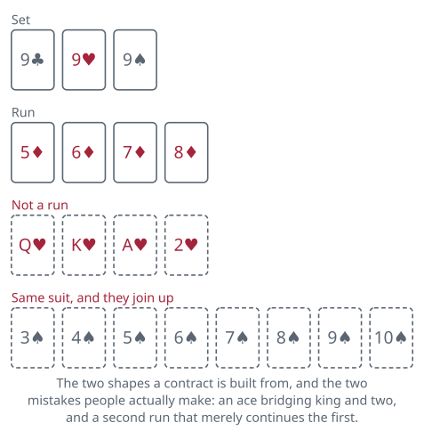

<!-- Generated by packages/build/render-markdown.ts from games/contract-rummy.json. Do not edit by hand. -->

# Contract Rummy

**Also known as:** Combination Rummy, Joker Rummy, Deuces Wild Rummy  
**Players:** 3-8 players (best with 4)  
**Deck:** 2 standard decks plus jokers for 3 or 4 players; 3 decks plus jokers for 5 or more  
**Time:** 60-120 minutes  
**Difficulty:** Medium  
**Category:** Rummy family  

## Setup

Contract Rummy is a rummy game with a syllabus. A full game is seven deals, and each one names in advance the exact combination you have to assemble before you are allowed to put a single card on the table. The requirement grows harder as the game goes on, opening at two sets and closing on three runs, so an early deal is a sprint and the last one is a slog.

Three to eight can play, and it is at its best with four or five. Up to four players shuffle two 52-card decks together with two jokers; from five up, use three decks and three jokers. The jokers are the wild cards, and a table that wants a looser game simply shuffles in more of them. Treat identical cards as interchangeable.

Draw for the first deal and pass it to the left afterwards, so with seven deals in a game everyone deals at least once at most player counts. The number of cards dealt is not the same throughout: ten each for the first three deals, twelve each for the last four, the step coming where the fourth contract begins asking for three combinations instead of two.

After dealing, stack the rest face down as the stock and turn its top card face up beside it to open the discard pile. The player to the dealer's left goes first.

A set is three cards of the same rank, suits ignored. A run is four cards of one suit in sequence. Aces work at either end — A-2-3-4 and J-Q-K-A are both fine — but they do not turn the corner, so K-A-2-3 is not a run. Everything else follows from that. Keep a running score across all seven deals; the pad matters more here than in most rummy games, because nobody wins a deal outright.

## Play

A turn is draw, meld or lay off if you are entitled to, then discard — the ordinary rummy shape, with two large complications bolted on.

Drawing. Take the top card of the stock or the top card of the discard pile, as usual.

Buying. This is where Contract Rummy stops resembling its relatives. A discard the player in turn does not want is not dead: anyone else at the table may speak up for it, and must do so before that player has drawn. What a buy costs is bulk. The buyer collects the card they asked for and a stock card charged on top of it as the price, which leaves them carrying more cards than anybody else, and none of it entitles them to act — no meld, no lay-off, no discard, since their own turn is still somewhere ahead of them. The interrupted turn simply picks up where it stopped, and the player whose turn it was draws off the stock. Where several people speak at once, seating decides: the claim belongs to whichever of them will be in turn soonest. The player in turn never buys; for them, taking the top discard is simply their draw. Buys are rationed, most tables allowing three to a player per deal; some allow only two, so settle it beforehand. Buying is the whole texture of the game. You will hold a hand that is one card short of the contract for six turns, watch that card land on the pile out of turn, and have to decide whether it is worth going a card deeper to get it.

Melding. Your first appearance on the table has to be the deal's contract, laid down complete in a single turn, and nothing more than the contract — no extra cards attached to the sets, no fifth card on a run. Until you have done that you may not put down anything at all, so a hand that is one card short of the contract is a hand with nothing on the table and everything counting against you. Laying the contract down is the whole of that turn's melding: nothing may be laid off, on your own melds or anybody else's, until your next turn comes round. Where a contract asks for two runs, most tables require them to be in different suits; a table that allows both in one suit still insists they be genuinely apart, since 3-4-5-6 and 7-8-9-10 of spades is one eight-card run wearing a disguise and never counts as two.

Jokers stand in for any card. A meld may hold more than one, though most groups frown on a contract met largely with wilds. Many tables let a player who holds the natural card a joker is representing swap it in and take the joker to use elsewhere; some restrict that to your own melds, others allow it against anybody's.

Laying off. Once your contract is down, later turns open up: you may add cards to any meld on the table, your own or anyone else's, and this is how you shed the rest of your hand. Nothing obliges you to lay off, but every card left in your hand at the end of the deal is a penalty, so there is rarely a reason to sit on one.

Discarding. Finish the turn by putting one card face up on the pile, which is the card the whole table is about to be offered.

Going out. The deal ends the moment somebody has no cards left. In the first six deals that means melding or laying off everything but one card and discarding it. The seventh deal is different: there is no final discard, so the whole hand has to go down at once in the three runs the contract asks for, which is why the last deal is the one most likely to finish with nobody out at all.

Running out of stock. When the last stock card is drawn, lift the discard pile, leave its top card lying where it is, shuffle the rest and set them face down as a fresh stock, and play on. If that stock empties too and still nobody has gone out, the deal stops there and everybody counts their hand — in that deal nobody escapes with zero.

## Goal & scoring

There is no winner of a deal, only a player who escapes it cheaply. When somebody goes out, everyone else counts what is still in their hand and takes it as penalty points, and the totals run cumulatively through all seven deals. Whoever has fewest points once the seventh deal is scored wins, and no standard rule breaks a tie — agree beforehand whether level players share it or play one more deal of the seventh contract to settle it. A player who goes out scores nothing for that deal, which is the best result available.

Cards count against you at these values:

- Each joker: 15
- Each ace: 15
- Each king, queen or jack: 10
- Everything else: 5

Two of those figures are worth a word before the first deal, because published rule sets genuinely disagree: some groups price jokers at 25 rather than 15 to discourage sitting on them, and some count tens with the face cards at 10 rather than with the low cards at 5.

The pressure the scoring creates is specific to this game. In an ordinary rummy you can meld a set early and reduce your exposure straight away. Here you may not put down anything at all until you have the entire contract, so an unlucky deal is one in which you hold twelve scoring cards from beginning to end and pay for every one of them. Buying a card to complete the contract two turns sooner is often worth going a card heavier, because the alternative is being caught with the lot.

| Scores | Value | Notes |
| --- | --- | --- |
| Deal 1 | Two sets | 10 cards dealt; 6 go down |
| Deal 2 | One set and one run | 10 cards dealt; 7 go down |
| Deal 3 | Two runs | 10 cards dealt; 8 go down, different suits |
| Deal 4 | Three sets | 12 cards dealt; 9 go down |
| Deal 5 | Two sets and one run | 12 cards dealt; 10 go down |
| Deal 6 | One set and two runs | 12 cards dealt; 11 go down, runs in different suits |
| Deal 7 | Three runs | 12 cards dealt; the whole hand, no discard |

## Variants

**Shanghai Rummy** — The best-known relative and in many places the more popular game. Ten deals rather than seven, eleven cards dealt every time, and twos are wild alongside the jokers. Going out in a single turn without having melded earlier in the deal — going out blind — earns a bonus subtracted from your score, doubled if you did it without a wild card. The extra deals stretch a session considerably, so it suits an evening rather than an hour.

**Zioncheck** — The 1930s American ancestor of the whole family. Its deals do not all follow one uniform procedure — each has quirks of its own — which makes it more of a curiosity now than a game anybody organises an evening around, but the fixed-contract idea starts here, and everything else in this group is a tidied-up version of it.

**Progressive and Liverpool Rummy** — Two widespread loosenings of the same skeleton. Progressive Rummy grows the deal size with every contract instead of stepping it up once, so the last hands are large and unwieldy on purpose. Liverpool Rummy runs a shorter list of contracts and throws in more jokers, which makes the contracts easier to fill and shifts the interest onto the buying. Both are usually played to the same cumulative low-score finish.

**Extra deals and house contracts** — Tables routinely bolt on an eighth deal, commonly four sets, or reorder the list so that the runs come earlier. Some also add a going-out bonus of 25 points deducted from the winner's total, which speeds up the endgame considerably: without it there is no reward for going out beyond avoiding penalties, so a player with a hopeless hand has little reason to hurry.

**Tags:** classic, counting, family-friendly, large-group, long-game, strategy

*Rules checked against: Pagat, Wikipedia, GameRules.com, Official Game Rules, Denexa Games, The Rummy Rulebook, Gambiter.*

---

Part of [Naibi](../README.md). Text licensed [CC BY-SA 4.0](../LICENSE).
