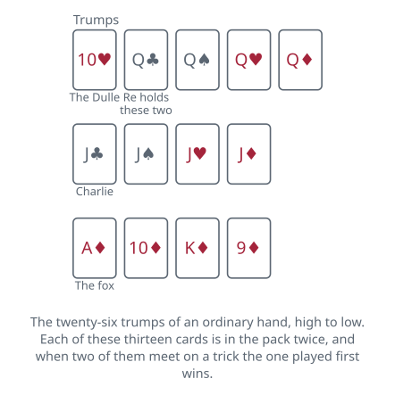
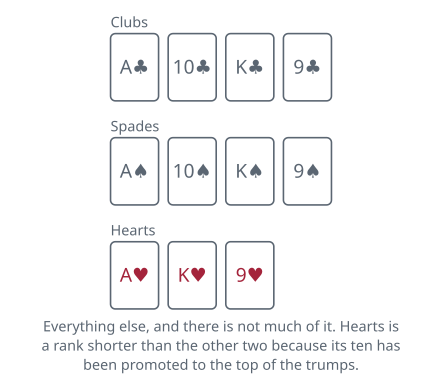

<!-- Generated by packages/build/render-markdown.ts from games/doppelkopf.json. Do not edit by hand. -->

# Doppelkopf

**Also known as:** Doko  
**Players:** 4-5 players (best with 4)  
**Deck:** 2 standard decks stripped to 48 cards (two of each A, K, Q, J, 10, 9 in every suit)  
**Time:** 45-90 minutes  
**Difficulty:** Complex  
**Category:** Trick-taking  

## Setup

An ordinary deal is two against two, and for the first trick or two nobody is sure which two. That is the game: the partnerships are hidden inside the deal and have to be worked out from what people play.

Build the pack from two ordinary decks. Take A, K, Q, J, 10 and 9 of each suit out of both and put the rest away, which leaves forty-eight cards and two identical copies of every one of them. Packs sold for the game in Germany hold the same forty-eight, usually in the ordinary suits with the queen indexed D for Dame and the jack B for Bube. Where German-suited cards are used instead, those two are the Ober and the Unter.

The rules below are the tournament rules of the Deutscher Doppelkopf-Verband, which is the one published standard the game has. Informal play is another matter — the association was founded in 1982 precisely because the game was played to very different rules from one region to the next, and it changed the kitchen table hardly at all, so a table you have not sat at before will have house rules. Ask before the first deal; the commonest additions are in the variants below.

Deal twelve cards to each player in four rounds of three, starting to the dealer's left and going clockwise. Nothing is left over. The deal moves one seat left each hand. Five may sit down, in which case the dealer takes no cards and no score that hand, so a fifth player costs everyone one hand in five rather than a seat.

Card values are the ones Skat uses: an ace is 11, a ten is 10, a king 4, a queen 3, a jack 2, and the nines count nothing. Sixty points sit in each suit and 240 in the pack, and the whole game is a fight over the halfway line.

The ranking is the part to learn before dealing rather than during. In an ordinary hand every queen, every jack and the whole diamond suit are trumps — twenty-six cards of the forty-eight — headed by the ten of hearts, which is called the Dulle. The queens come next in the fixed order clubs, spades, hearts, diamonds, then the four jacks in that same order, then diamonds from the ace down. What is left is three short side suits: clubs and spades run ace, ten, king, nine, and hearts runs ace, king, nine, because its ten has gone to the trumps.

One consequence catches everyone. Since each card is in the pack twice, two players can put the identical card on a trick, and the one played earlier is the one that wins it. That is true of the Dulle as well.

## Play

Reservations. Before a card is played the table finds out what kind of hand this is. Starting to the dealer's left, each player says gesund — healthy — meaning an ordinary hand suits them, or Vorbehalt, a reservation, meaning it does not. Four healthies and it is a normal hand. Otherwise whoever reserved says what they want, and the highest-ranking wish is played: a solo outranks a marriage, and a solo somebody is obliged to bid outranks a voluntary one, since a tournament round requires each player to take one solo during it. Where two players want the same thing the earlier speaker gets it.

A normal hand needs no declaring at all, and this is the mechanism the whole game hangs on. The two players holding the queens of clubs are the Re side and the other two are Kontra, and nobody says which they are. Working that out, and keeping your own side quiet, is most of the skill.

A marriage is what a player does when both queens of clubs turn up in one hand. Rather than take on three opponents alone, they declare Hochzeit and then take as partner whoever wins the first trick that the marriage holder does not — the clarifying trick — within the first three. Win all three yourself and the offer expires: you finish the hand as a lone diamond solo. A player dealt both queens who says nothing at all is committed to a silent marriage, which is that same diamond solo played without warning anybody.

A solo is one player against three, and it changes what is trump:

- Suit solo: the declared suit's ace, ten, king and nine take over the place the diamonds held, at the foot of the trump order below the queens and jacks. Hearts as trump is the awkward one, since its ten is already the Dulle, so a hearts solo has twenty-four trumps rather than twenty-six.
- Queen solo: the eight queens and nothing else. Every suit then runs ace, ten, king, jack, nine.
- Jack solo: the eight jacks and nothing else, with the suits running ace, ten, king, queen, nine.
- Aces solo: no trumps whatsoever, all four suits ace, ten, king, queen, jack, nine. Its German name, Fleischloser, means meatless.

The tricks. Whoever spoke first in the reservations leads to the first trick, except that a compulsory solo hands the lead to the soloist; after that the previous trick's winner leads. Follow suit if you can — and the trap is that the trumps count as one suit for that purpose, having eaten three ranks out of every other. A spade lead asks for the ace, ten, king or nine of spades and nothing else, so the queen of spades will not answer it, and leading that queen asks the table for trumps rather than for spades. Anyone who cannot follow may trump or throw away, as they like — there is no obligation to do either. A trick with any trump on it belongs to the highest of them; a trick with none belongs to whoever went highest in the suit that opened, and two identical cards are settled by which was put down first.

Announcements. These raise what the hand pays and are the only sanctioned way to tell your partner you exist. A player says Re while holding at least eleven cards to claim the queens-of-clubs side will win it, or Kontra on the same terms for the other side; because that is eleven and not twelve, the first trick is free and you can watch it before committing. Everything beyond that is a claim about how badly the opponents will do, and each step demands a card fewer in hand and rests on the step before it:

- No 90 — the opponents will finish under 90 — with at least ten cards.
- No 60, with at least nine.
- No 30, with at least eight.
- Schwarz, meaning they will not take a single trick, with at least seven.

None of these may be said before your side has said Re or Kontra, so the ladder is climbed in order or not at all. After a marriage the clock starts late: nothing may be announced until the clarifying trick is finished, since until then nobody knows who they are playing with.

## Goal & scoring

Count the card points in your side's tricks. Re has to reach 121 of the 240 and Kontra needs only 120, since a tie in cards goes to the defenders. Announcing changes those numbers: say Kontra and your own bar rises to 121, and every no-90 or no-60 you announce replaces the bar with the one you promised, so a side that said no 60 must actually take 181 and loses the hand at 180 however comfortable that sounds.

What gets written down is a single figure per deal, plus for the winners and minus for the losers, so the four columns always add to nothing. The figure is built by adding a point for each thing that actually happened, and almost everything counts once: the win itself, every thirty-point threshold the losers fell under, a clean sweep of the tricks, each negative announcement anybody made, and each of those the winners went on to play through anyway. Re and Kontra are the exception at two points each, and they count for whichever side ends up collecting rather than for whoever said them. The table has the full list.

Four more are available in a normal hand only, and never in a solo. One goes to Kontra simply for beating the queens of clubs. One goes for taking a trick worth 40 or more, which is itself called a doppelkopf and can only happen when all four cards are tens or aces. One goes for capturing an opponent's ace of diamonds, the fox. One goes for winning the final trick with a jack of clubs, known as Charlie Miller.

A soloist's figure is tripled and written into their own column alone, while each of the three opponents takes the untripled figure with the sign reversed. Losing a solo you talked up is the expensive way to spend an evening.

There is no target score in the rules. A session is an agreed number of deals, usually whole rounds of the table so that everybody deals equally often, and the highest running total at the end wins. A tournament round is twenty-four deals and is stopped at a hundred minutes of play, which is a fair guide to how long a dozen hands will take you.

| Scores | Value | Notes |
| --- | --- | --- |
| Ace | 11 | — |
| Ten | 10 | — |
| King | 4 | — |
| Queen | 3 | — |
| Jack | 2 | — |
| Nine | 0 | 240 in the pack, so Re needs 121 and Kontra 120 |
| Winning the hand | 1 | — |
| Losers held under 90, under 60, under 30 | +1 each | — |
| Losers took no trick at all | +1 | — |
| Re announced | +2 | — |
| Kontra announced | +2 | — |
| No 90, no 60, no 30 or schwarz announced | +1 each | counted whichever side announced it |
| Winners played through an announcement | +1 each | 120 against no 90, 90 against no 60, 60 against no 30, 30 against schwarz |
| Kontra beat the queens of clubs | +1 | normal hands only, never in a solo |
| A trick worth 40 or more | +1 | the doppelkopf the game is named for |
| Caught an opponent's ace of diamonds | +1 | — |
| Jack of clubs took the last trick | +1 | — |
| Solo | x3 for the soloist | each opponent takes the untripled figure with the sign reversed |

## Variants

**Poverty (Armut)** — The best known of the additions the tournament rules leave out, and worth having. A player dealt three trumps or fewer may reserve and declare poverty, then push three cards face down across the table, which must include every trump they hold. Going clockwise, each of the others may take the three cards unseen and return any three in exchange; whoever accepts becomes the partner for the hand and the two of them are Re. Turned down all round, the deal is annulled and the same dealer deals again. It is a better contract than it looks, because the pauper can now throw high cards onto tricks the partner is already winning.

**Without nines** — Throw all eight nines out and play a forty-card pack, ten cards each. Called scharfer Doppelkopf, sharp Doppelkopf, and popular enough in casual play to be worth asking about before you sit down. Every hand is stronger, the dead cards are gone, and the balance tips further toward the trumps, which go from 26 of the 48 to 24 of the 40. Everything else is unchanged.

**The second Dulle wins** — Some tables reverse the tie rule for the tens of hearts alone, so that when both fall on one trick the second beats the first. It looks like a footnote and is not: holding the Dulle is no longer a safe way to take a trick you must have, and the standard trick of leading one at a marriage in order to be adopted stops working. A common refinement plays it the ordinary way round on the last trick only.

**Piglets (Schweinchen)** — A player dealt both aces of diamonds may announce Schweinchen, and those two cards become the highest trumps in the hand, above the Dulle. Tables disagree about when the announcement has to be made and whether one or both aces are promoted, so settle it first. Where piglets are played, a holder of both nines of diamonds can sometimes answer with super piglets, which go above the piglets in turn.

**Bock rounds** — A doubling round triggered by an agreed event — a hand where both sides take exactly 120, a Re or Kontra announced and then lost, a deal that scores nothing. From the next deal onward every score is doubled for a full round of the table, one deal per player. Nothing in the tournament rules knows about them; they belong to casual play, along with poverty and the piglets, which is reason enough to ask what is running before you sit down.

## Background

Doppelkopf grew out of Schafkopf, the south German game that had a written rulebook by 1895, by the straightforward expedient of playing it with two packs — the doubling is where the name comes from. It went the other way geographically from its parent and is now played across Germany but concentrated in the north and around the Rhine and the Main.

Until the 1980s there was no such thing as the rules of Doppelkopf, only the rules wherever you happened to be. The Deutscher Doppelkopf-Verband was founded in March 1982, at the first German championship in Braunschweig, to write a single set for competition. It succeeded at that and left the kitchen-table game largely as it found it, which is why an entry like this one has to say which rules it is describing.

**Tags:** classic, counting, long-game, partnership, strategy

*Rules checked against: Pagat, Wikipedia, Deutscher Doppelkopf-Verband.*

---

Part of [Naibi](../README.md). Text licensed [CC BY-SA 4.0](../LICENSE).
