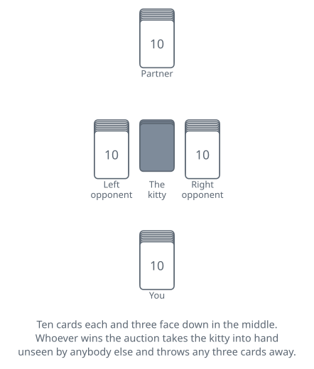
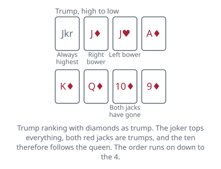
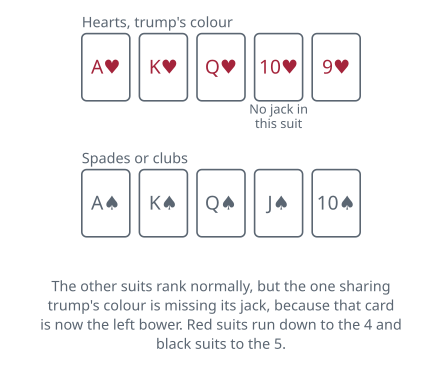

<!-- Generated by packages/build/render-markdown.ts from games/five-hundred.json. Do not edit by hand. -->

# Five Hundred

**Also known as:** 500  
**Players:** 3-5 players (best with 4)  
**Deck:** 1 standard deck cut down to 43 cards — A to 5 in the black suits, A to 4 in the red suits, plus one joker  
**Time:** 45-90 minutes  
**Difficulty:** Complex  
**Category:** Trick-taking  

## Setup

Five Hundred is Euchre grown up: ten cards instead of five, an auction instead of a turned-up card, a three-card kitty for whoever wins it, and a contract to lose every trick for anyone brave enough. It was invented in the United States and copyrighted there in 1904, and it is now Australia's national card game, which is a fair summary of how these things go.

Build the pack by taking a standard deck and removing every 2 and every 3, plus the 4 of spades and the 4 of clubs. Add one joker. That leaves forty-three cards: the black suits run from the ace down to the five, the red suits down to the four, and the joker sits outside all of them.

Two partnerships of two, each pair facing one another across the table. Pick a first dealer however you like; from then on everything in this game — dealing, bidding, playing — travels to the left.

Deal ten cards to each player and three face down in the middle as the kitty. The traditional rhythm interleaves them: three each and one to the kitty, four each and one to the kitty, three each and the last to the kitty.

One score sheet, two columns, running from zero in both directions. Both directions matters — a side can lose this game by going far enough backwards, and a column that only counts up will not show it coming.

## Play

The auction opens to the dealer's left and goes round as many times as it needs to. Pass and you are out of it for good. Everything else is a claim on a number of tricks, six at the least, played some particular way:

- A number and a suit. Eight diamonds undertakes that you and your partner will take at least eight of the ten tricks with diamonds as trumps.
- A number and no trumps. The same undertaking with no trump suit at all.
- Misère: you will lose every trick, playing alone while your partner lays their hand face down and sits it out.
- Open misère: the same, except that after the first trick you spread your hand face up on the table and play the rest of it in plain view.

Bids outrank each other by tricks first and then by suit, and the suit order is the one thing to memorise: spades lowest, then clubs, diamonds, hearts, and no trumps highest. Six spades is the cheapest bid available and ten no trumps the dearest. The two misères are slotted into that ladder by value rather than by trick count — a plain misère sits above every bid of seven and below every bid of eight, and may only be called once somebody has actually bid seven, while an open misère outranks ten diamonds and may be called at any point, including as the opening bid.

Everyone passing throws the hand in.

The last bidder standing takes the kitty into hand without showing it, then buries any three cards face down — the discards may include cards that came out of the kitty. Those three are out of the game. Then the contractor leads to the first trick.

Play itself holds no surprises. Follow the suit led while you hold it and throw whatever you like once you do not; the biggest trump in a trick takes it, and with no trump present the best card of the led suit does; whoever collects a trick leads to the next.

What is not orthodox is the trump suit, which runs thirteen deep rather than ten or eleven. On top of it is the joker. Under the joker, the right bower, meaning trump's own jack. Under that, the left bower — the matching jack from the suit of the same colour, which has abandoned its printed suit completely and counts as a trump for every purpose there is, following suit included. Then the ace, the king, the queen and straight on down to the ten, since both jacks are elsewhere. The suit that shares trump's colour is left nine or ten cards long with no jack at all.

The joker without a trump suit to belong to needs its own set of rules, and they are worth reading before a no-trump or misère contract rather than during one:

- The contractor, if holding it, may nominate a suit for it before the opening lead, and it is then simply the top card of that suit.
- Unnominated, it belongs to no suit, beats everything, and is restricted instead. Following someone else's lead you may only play it when void in the suit led. Under a misère you must play it when void; under a no-trump contract you need not, and may keep it back.
- You may lead the joker and name a suit that everyone else must follow, so long as that suit has not been led before. That privilege expires: with every suit already opened, leading the joker becomes illegal, and the last trick of the hand is the only exception.

One trap follows from all that. A misère bidder who keeps the joker and forgets to nominate a suit for it has already lost the contract, because the joker will win the trick it is played to and there is nothing to be done about it.

## Goal & scoring

Five hundred points wins, which is where the name comes from, and there is a condition on it that decides real games: you have to get there on a hand you bid and made. Points picked up defending somebody else's contract will carry you past 500 and leave you sitting there unable to finish, playing on until you win a contract of your own. There is also a back door. Reach minus 500 and you have lost the game outright, without anyone having to win it.

What a contract is worth looks like a table to memorise and is really one formula. Six spades is 40. Every extra trick you undertake adds 100, and every step up the suit order — spades to clubs to diamonds to hearts to no trumps — adds 20. So eight hearts is 40, plus 200 for the two tricks above six, plus 60 for hearts being three steps above spades: 300. The two misères are priced flat, at 250 and 500, which is what fixes them where they sit in the bidding order.

Take the tricks you bid and your side scores the contract's value. Extra tricks beyond the bid earn nothing at all, with one exception: sweep all ten and a contract worth less than 250 pays 250 instead. Above 250 there is no bonus, because you were already being paid enough.

Fall short and the same number comes off your score instead, which is how a side ends up going out backwards. A greedy ten no trumps that fails costs 520 in a single hand and can lose the game on its own.

The defenders score 10 a trick for every trick they take, and they score it whether the contract stood up or not. This matters more than it looks: it means defending is never wasted effort, a hopeless hand is still worth fighting for scraps in, and a side can climb most of the way to 500 on other people's contracts — only to find they still have to bid something to close it out.

Misère pays nothing to the defenders either way. The contractor either loses every trick and takes 250 or 500, or wins one and drops the same amount.

| Scores | Value | Notes |
| --- | --- | --- |
| Six tricks | 40 to 120 | spades 40, clubs 60, diamonds 80, hearts 100, no trumps 120 |
| Seven tricks | 140 to 220 | — |
| Eight tricks | 240 to 320 | — |
| Nine tricks | 340 to 420 | — |
| Ten tricks | 440 to 520 | — |
| Misère | 250 | outranks any bid of seven, ranks below any bid of eight |
| Open misère | 500 | outranks ten diamonds, ranks below ten hearts |
| Slam on a contract worth under 250 | 250 instead of the bid | — |
| Contract failed | minus its full value | — |
| Each trick taken by the defenders | 10 | scored win or lose, but never against a misère |
| Winning the game | 500 | only on a hand you bid and made; minus 500 loses outright |

## Variants

**Three-handed** — Cut the pack down again so that the seven is the lowest card in every suit, giving 33 cards with the joker, and deal ten each with a three-card kitty as usual. There are no fixed partnerships: whoever wins the auction plays alone and the other two combine against them for that hand only. Every player keeps their own score, and the same conditions apply — 500 or more on a contract of your own wins, minus 500 loses. It is the sharpest version of the game, because the contractor gets no help at all and the defenders have to work out between them who is covering what.

**Five-handed** — Use the whole 52-card deck plus the joker, 53 in all, and deal ten each with the usual kitty. After discarding, a contractor playing a suit or no-trump contract either announces they are going alone against the other four, or names any single card other than the joker or a bower — whoever holds it is their partner and must not say so. The partnership becomes public when the named card appears, which is often several tricks in and occasionally never. A called partner shares the contract's value or its loss equally; a contractor going alone takes all of it. Misère is always played single-handed.

**Six-handed** — Two partnerships of three, sitting alternately, playing by the four-handed rules. It wants a purpose-made 63-card pack with 11s and 12s in every suit and 13s in the red suits, ranking between the 10 and the jack — these are sold as six-handed 500 decks, and in Australia are commonly used for the four-handed game too with the extras taken out. Failing that, add the 2s, 3s and red 4s from a second deck and agree that where two identical cards fall in one trick, the first one played beats the second. Under a misère both of the contractor's partners lay their hands down.

**A joker that is only a trump** — Some tables cut the no-trump joker rules out entirely: the joker is the highest card in the pack, may be played to any trick regardless of what you hold, and may be led at any time with the leader naming the suit to be followed. Others go the other way and require the contractor to nominate a suit for it in every no-trump contract. Either simplification removes the misère trap of holding an unnominated joker, and both are worth settling before the bidding rather than discovering in the middle of a 500-point contract.

**Tags:** classic, counting, long-game, partnership, strategy

*Rules checked against: Pagat, Wikipedia.*

---

Part of [Naibi](../README.md). Text licensed [CC BY-SA 4.0](../LICENSE).
