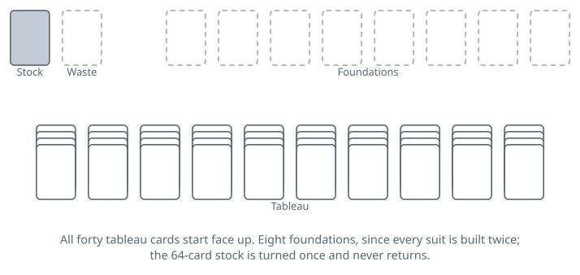

<!-- Generated by packages/build/render-markdown.ts from games/forty-thieves.json. Do not edit by hand. -->

# Forty Thieves

**Also known as:** Napoleon at St Helena, Big Forty, Roosevelt at San Juan, Le Cadran  
**Players:** 1 player  
**Deck:** 2 standard decks (104 cards)  
**Time:** 20-45 minutes  
**Difficulty:** Easy  
**Category:** Solitaire (1 player)  

## Setup

Shuffle two full 52-card decks together into a single 104-card pack. Deal 40 cards face up into ten columns of four, going across the row so each column takes one card per pass, and overlap them so every rank stays readable. Nothing is concealed: all forty are in plain sight before you touch anything.

The rest of the pack goes face down as the stock, with a space beside it for the waste. Above the tableau, leave room for eight foundations — each suit is built twice, once from each deck.

Clear a broad table first. Two decks in ten columns need considerably more space than any one-deck game, and by mid-play a single column can run past a dozen cards.

## Play

The eight foundations climb in suit from the ace — two spade piles, two heart piles, two of each of the others, every one running ace to king. A card sent to a foundation is finished with. It cannot be brought back down, which turns each promotion into a decision rather than a reflex.

The ten columns build downward in suit and in suit only. The 9 of spades goes on the 10 of spades and nowhere else at all. Ranks do not wrap round: an ace at the end of a column is the bottom of its run and takes nothing, and a king moves only to an empty column or onto its own foundation. Anyone arriving from Klondike will lay a red card on a black one out of pure habit; there is no colour rule here to reward that.

Then the restriction the game is famous for. Exactly one card moves at a time, always. Your candidates are the exposed card at the end of a column and the card on top of the waste, and either may go to a foundation, onto another column, or into an empty column. Suppose a column ends in the 10, 9, 8 and 7 of spades in perfect order: you still have to relocate them one by one, which means finding homes for three of them before the run can travel anywhere. Nothing anywhere in the rules picks up a group.

An empty column, by contrast, takes any card whatever. Empty columns are the only manoeuvring room the game hands you, and most of Forty Thieves strategy follows from that single fact. A spare column is how you dig out a buried ace, how you reverse a column into a usable order, and how you unload the waste. Filling one thoughtlessly is the move that most often loses the deal.

Turning the stock is your own affair: one card at a time onto the waste, whenever you choose, with nothing obliging you to wring the tableau dry first. Only the waste's top card is live, and cards come off it singly. There is one pass and no redeal: 64 cards, 64 turns, and once the last is face up the stock is gone for good. Whatever you strand under an unplayable waste card stays stranded until that card finds a home.

Nothing is compulsory, and holding a card back is often correct. The 5 of diamonds sitting at the end of a column is somewhere to park the 4 of diamonds; on the foundation it is somewhere you no longer have. Because promoted cards never come back, the standard advice about clearing cards upward as fast as possible is actively bad here.

The deal is over when all eight foundations are complete, or when the stock is spent and nothing legal remains. You will usually recognise a loss well before that formal ending: once both copies of a card you need are buried under lower cards in every column, with no empty column in prospect, the position is dead even though moves are still available.

## Goal & scoring

You win by completing all eight foundations — every suit built twice, ace through king, all 104 cards off the table. There is nothing in between; the deal is won or it is not.

Traditional play keeps no score, and computer versions that add one usually borrow the Klondike arrangement of points per card promoted plus a time bonus. The figure people actually quote about this game is its win rate, and it is punishing. Large runs of random deals played without much care come in around four games in a hundred. Players who plan several moves ahead and treat empty columns as the scarce resource they are report something closer to one deal in ten. Both numbers are honest; they are measuring different players.

No exhaustive solver study has settled Forty Thieves the way one settled FreeCell, so the true ceiling — how many deals fall to perfect play with full information — is unknown. What is clear is that the spread between careless and careful results is unusually wide for a solitaire game, which is the signature of a game where skill genuinely bites. Losing is the normal outcome, and the sensible way to keep score is across a session rather than a deal.

## Variants

**Josephine** — The Forty Thieves layout and rules with the one-card restriction dropped: a descending same-suit run at the end of a column may be lifted and moved as a block. The run has to be in order and in suit to travel, and an empty column will accept a whole run as readily as a single card. That one change removes most of the drudgery of shuffling cards through empty columns and lifts the win rate enormously, which is why it is the version many people prefer to play.

**Streets** — Everything as in Forty Thieves — ten columns of four, eight foundations, one pass through a 64-card stock, one card moved at a time — except that the tableau builds down in alternating colours instead of in suit. Doubling the number of cards that will accept any given card makes a real difference, and it is the natural first step down in difficulty for anyone finding the parent game airless.

**Maria** — Nine columns of four rather than ten, so 36 cards are dealt and 68 go to the stock, and the tableau builds down in alternating colours. The narrower tableau costs you a column of working space while the colour rule gives back flexibility, leaving a game that sits between Forty Thieves and Streets.

**Limited** — Twelve columns of three, again 36 cards on the table, with the same same-suit building and the same one-card-at-a-time rule as Forty Thieves. Shallow columns mean far less is buried at the outset and two extra columns mean more places to put things, so the opening is much freer even though nothing about the movement rules has been relaxed.

**Rank and File** — Ten columns of four again, but only the last card of each column is dealt face up; the three under it lie face down and turn over as they are uncovered. Ten cards visible at the start where Forty Thieves shows forty, which hands the game the hidden information the parent has none of. The tableau builds down in alternating colours. Most rule sets also allow a descending alternating-colour run to travel as a block, the way Josephine does, while a few hold to the strict one-card rule; agree which you are playing before you deal, because it changes the game markedly. Also seen as Dress Parade.

**Tags:** classic, counting, luck, solo, strategy

*Rules checked against: Wikipedia, Solitaire Central Rulebook, Semicolon Solitaire Rules, BVS Solitaire, Solitaire Association, Denexa Games, SuitedGames, Solitaired.*

---

Part of [Naibi](../README.md). Text licensed [CC BY-SA 4.0](../LICENSE).
