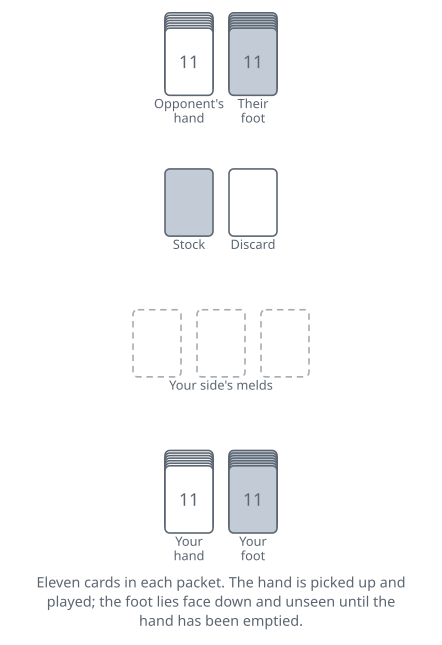
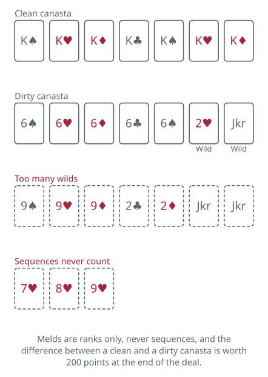

<!-- Generated by packages/build/render-markdown.ts from games/hand-and-foot.json. Do not edit by hand. -->

# Hand and Foot

**Also known as:** Hand & Foot, Hand and Foot Canasta  
**Players:** 2-6 players (best with 4)  
**Deck:** One more deck than there are players, jokers included: 5 decks and their 10 jokers (270 cards) for the usual four-player game  
**Time:** 90+ minutes  
**Difficulty:** Complex  
**Category:** Rummy family  

## Setup

Hand and Foot is the North American Canasta that took over the kitchen table. It keeps Canasta's melds of seven, its wild twos and jokers and its red threes, and adds one idea of its own: you are dealt two packets of cards instead of one, and you have to work your way out of the first before you are allowed to look at the second.

Two to six can play. Four is the standard game, two partnerships sitting opposite one another; six splits into three pairs, and at two, three or five everyone plays alone. The usual formula for the pack is one deck more than there are players, jokers left in, so four players shuffle five decks together and get 270 cards. Plenty of groups simply keep five or six decks bagged up and use them whatever the turnout.

Cut for the first deal, high card taking it, and pass the deal one seat to the left for each of the four hands; play runs clockwise throughout. Deal two packets of eleven to every player. The first is the hand, which you pick up and sort. The second is the foot, which goes face down in front of you untouched, and stays there until the hand is gone. Many tables skip the dealing entirely and have each player cut their own two packets out of the shuffled pile, counting them afterwards to check.

What is left goes face down as the stock — with a pack this size it is normally split into two or three separate draw piles so everyone can reach one. Turn one card face up to start the discard pile; if it is a red three or a wild card, bury it and turn another.

Before anyone plays, each player lays any red threes from their dealt hand face up in front of them and draws a replacement from the stock for each, repeating if a replacement is itself a red three; red threes that turn up later in a foot are treated the same way when that foot is picked up. The player to the dealer's left takes the first turn.

Melds belong to the partnership rather than the player, so keep them in one group between you where both can reach. A full game is four deals with a rising entry price, and the score is cumulative.

## Play

There are no sequences in this game. A meld is three or more cards of one rank, four up to ace, and suits never matter. Jokers and twos are wild. Once a meld reaches seven cards it is a canasta and takes no more; to go on melding that rank, start a fresh pile beside it. The two kinds are counted separately all game: a clean canasta is seven natural cards with no wild among them, a dirty canasta is seven cards with at least one wild in it. Most tables cap a dirty meld at two wild cards and insist the naturals always outnumber them; a few allow three. Square a finished canasta up and mark it — a red card on top for clean, a black one for dirty — so both partnerships can see at a glance where each side stands.

A turn is draw, meld if you like, discard one. Drawing means taking two cards off the stock, not one.

Taking the pile instead. Rather than drawing, you may claim the discard pile, but you only get the top card and the six beneath it — seven cards, not the whole heap, and only what is there if the pile is shorter. The price is that you must hold two natural cards of the top card's rank and put all three down as a meld straight away; the other six cards go into your hand. Wild cards are no help in qualifying, which means a wild card on top is as untakeable as a black three on top, and a black three on top blocks the pile completely — the only thing black threes are good for. Taking the pile replaces your draw, and the turn still ends with a discard.

The entry price. Neither partner may put anything on the table until the side lays out melds reaching the deal's minimum in card points, all in one turn: 50 in the first deal, then 90, then 120, then 150. When you meet the minimum by taking the pile, only the top card counts toward the total; the six cards underneath are yours to keep but contribute nothing to the requirement.

Threes. A red three drawn into your hand goes face up in front of you at once and you draw a replacement. Black threes are never melded during play and cannot be melded onto; they sit in hand as dead weight until you throw one, and their only use is the turn they spend blocking the next player.

Getting into the foot. This is the pivot the whole game turns on. When your hand is finally empty you pick up the foot and go on playing from it — and how you emptied it decides when. Empty it by melding, with no card left to throw, and the foot comes up immediately and your turn continues from the new cards. Empty it by discarding your last card and the turn is over; the foot waits for you until next time. That one-turn difference is worth planning several turns ahead, because a partner stuck in their hand while you are in your foot cannot help you finish.

Going out. To end the deal you must be playing from your foot, your side must have completed its quota of canastas, and you must shed everything, normally melding all but one card and discarding the last. The usual quota is two clean and two dirty canastas, the same in every deal, which stops a side from finishing early on a thin table; plenty of tables raise it for the fourth deal or cut it for a shorter game, and the quota is the single most house-ruled thing in the game. Before you commit, ask your partner whether you may go out, and abide by the answer — a no usually means they are holding cards that will cost the side more than your finishing is worth.

The stock running out. If the draw piles empty before anyone goes out, play stops there. Nobody gets the going-out bonus and the deal is scored as it lies, which normally hurts whichever side has the most left in hand.

## Goal & scoring

A game is four deals and the highest cumulative total wins; there is no target to race to, which means a side that falls behind early has a genuine reason to keep playing, since the bonuses are large enough to swing a deal at any point.

Each deal is scored for the partnership as a whole. Add the bonuses for every canasta the side finished, add 100 if one of your players went out, add the red threes, then add the face value of every card you have melded and subtract the face value of every card still sitting in either partner's hand or unopened foot. An unplayed foot is expensive — eleven untouched cards can wipe out a canasta — which is why getting into it early matters more than melding pretty.

Red threes are the field's biggest disagreement. The version described here pays 100 each to the side that laid them face up. Many groups instead pay them only to a side that finished at least one canasta, some charge a flat penalty of several hundred points to anyone caught holding one when the deal ends, and a few pay a large bonus for collecting all of them. Black threes are worth 5 against you and nothing at all for you.

The scoring is the reason a partnership talks. Two clean canastas and a quick exit will usually beat a table full of dirty ones, and a partner who says no to going out is normally saying they are sitting on a foot they have not opened yet.

| Scores | Value | Notes |
| --- | --- | --- |
| Joker | 50 | — |
| Two | 20 | — |
| Ace | 20 | — |
| King down to eight | 10 | — |
| Seven down to four | 5 | — |
| Black three | 5 | against you only; never melded during play |
| Red three | 100 | each, to the side that laid it face up |
| Clean canasta | 500 | — |
| Dirty canasta | 300 | — |
| Going out | 100 | — |
| Cards left in hand or foot | deducted | at face value, both partners |
| Minimum meld, first deal | 50 | — |
| Minimum meld, second deal | 90 | — |
| Minimum meld, third deal | 120 | — |
| Minimum meld, fourth deal | 150 | — |

## Variants

**Hand, Knee and Foot** — Three packets instead of two, worked through in order, usually eleven in the hand, eleven or thirteen in the knee and thirteen in the foot. The game runs half again as long and the pack grows to match, six or seven decks being normal. Everything else is unchanged, but the penalty for never reaching your last packet becomes severe enough that partnerships plan their whole deal around opening the knee.

**Pennies from Heaven** — A widely played cousin in which sevens are singled out: the side must complete a canasta of sevens before it may go out, and finishing one pays a bonus far larger than an ordinary clean canasta. Some versions add a card drawn from the stock and set aside whenever a canasta is completed, which is where the name comes from. It makes low cards suddenly precious and changes what is safe to discard for the whole table.

**Two, three and five players** — With any count that does not split into pairs, everyone plays alone, and many groups deal larger packets — thirteen or fifteen in each of the hand and the foot — to make up for having no partner to build with. Going-out quotas are usually cut to one clean and one dirty canasta, because a single player cannot realistically produce four.

**House rules that actually differ** — Hand and Foot has no governing body and its rule sets disagree loudly. Common points to settle first: whether melds are capped at seven cards or may keep growing, whether a canasta may be started with wilds before its naturals arrive, how many wild cards a dirty canasta may hold, whether the pile is taken as seven cards or in its entirety, whether red threes pay or penalise, and how many canastas of each colour the going-out quota demands. A table that agrees these before the first deal will avoid the argument that otherwise arrives in deal three.

**The exact cut** — A popular flourish at the dealing stage. Instead of being dealt to, each player cuts their own hand and foot off the shuffled stack in one grab and counts afterwards; cutting the exact number needed earns a bonus, commonly 100 points. It costs nothing and gives the deal a small ceremony, which is part of why the game spread through clubs and cruise ships the way it did.

**Tags:** counting, family-friendly, large-group, long-game, partnership, strategy

*Rules checked against: Pagat, Bicycle Cards, GameRules.com, Official Game Rules, Denexa Games, World of Card Games, Gambiter.*

---

Part of [Naibi](../README.md). Text licensed [CC BY-SA 4.0](../LICENSE).
