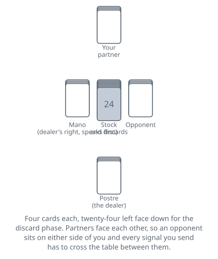
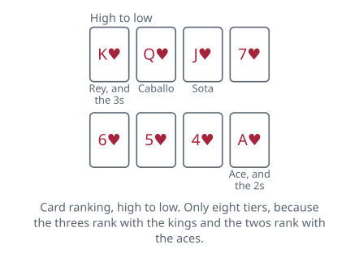
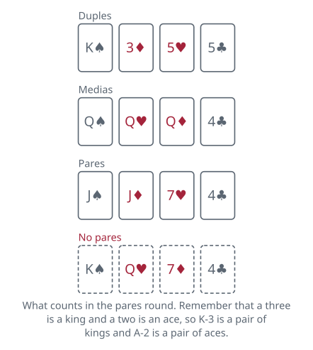

<!-- Generated by packages/build/render-markdown.ts from games/mus.json. Do not edit by hand. -->

# Mus

**Also known as:** Musa  
**Players:** 4 players  
**Deck:** 1 standard deck stripped to 40 cards (8s, 9s and 10s removed), or a 40-card Spanish pack  
**Time:** 45-90 minutes  
**Difficulty:** Complex  
**Category:** Bluffing  

## Setup

Mus is a four-player partnership game and that is the version everyone means by the name. Partners sit opposite one another so the two sides alternate round the table.

Use a forty-card Spanish pack, or an ordinary pack with the eights, nines and tens taken out, jack standing for the sota, queen for the caballo and king for the rey. Suits do not matter anywhere in the game — there are no flushes, no trumps, and nothing that asks what suit a card is.

Two ranks are impostors, and this single rule shapes almost everything else. Threes play exactly as kings and twos play exactly as aces, in all four betting rounds and for every purpose. The pack therefore behaves as though it holds eight kings and eight aces with only six ranks in between, which makes the highest and lowest cards common enough to fight over and the middle of the pack nearly worthless.

Cut for the first deal, low card dealing. The dealer gives four cards to each player one at a time, going anticlockwise, and the rest of the pack stays face down within reach. The player on the dealer's right is the mano: first to speak in every round and the winner of every tie. The dealer is the postre and always speaks last. Both roles move one seat to the right after each hand.

Score with counters, one pile per side. Points are called stones, five stones make an amarreko, and eight amarrekos — forty stones — end the game. Eight large counters and four small ones per side will show any score up to that; forty identical counters do the job just as well.

## Play

Mus runs in two phases: a public negotiation about whether to redraw, then four separate betting rounds fought over the same four cards.

The discard. Beginning with the mano and going anticlockwise, each player says mus or no hay mus. Only if all four say mus does anything happen: everyone then throws out between one and four cards face down — you may not agree to mus and then keep all four — and the dealer replaces them from the stock, mano first. The question then comes round again, and there is no limit to how many times it can. The instant one player says no hay mus the discarding is over for that hand and the betting starts. If the stock runs short mid-replacement, shuffle the cards already discarded this hand and carry on from them. Note what agreeing to mus costs you — you have declined to bet in front of three people, so a hand worth keeping is a hand you have just announced.

Signalling. Partners are allowed, and expected, to tell each other what they hold. The vocabulary is a fixed set of facial signals made across the table while the opponents watch for them: biting the lower lip is two kings, showing the tip of the tongue is two aces, raised eyebrows are duples, a wink is thirty-one, closed eyes are a hand with nothing in it at all. Lists vary by region and clubs publish their own. What does not vary is the discipline. A signal may only be made for a hand you genuinely hold, and you may not signal one part of a hand to disguise the rest. All the deception in mus happens in the betting; none of it happens in the signs. Most tables allow signals only while the mus phase is open, or at the first opportunity after it closes, and catching an opponent mid-signal is a legitimate and much-enjoyed part of playing.

The four rounds. Grande, chica, pares and juego are played in that fixed order, each finished before the next begins.

- Grande is a contest for the highest cards. Compare best card against best card; if those match, compare the second, then the third, then the fourth.
- Chica is the same contest inverted, looking for the lowest hand and comparing from the bottom up.
- Pares is for matched ranks. Everybody first declares truthfully whether they hold anything at all, and only those who do take any part in the round. Two pairs (duples) beat three alike (medias), which beat a single pair (pares); inside a class the higher ranks win, and duples are compared on the better pair first and then on the other. Four alike counts as duples of that rank, which is the best pares holding there is.
- Juego is for a hand whose four cards total thirty-one or more. Again everybody declares yes or no first. If nobody has juego, the round is played as punto instead — a contest for the highest total below thirty-one.

When a declaration round has nobody to argue with. If only one side declares for pares, or only one side for juego, there is nothing to bet against: that side takes the round outright and simply collects for what it holds. If neither side declares, the round is skipped and nobody scores from it at all.

Betting a round. The mano speaks first and each player in turn passes or bets. A bet is a number of stones, two at the minimum, and naming no number means two. Opponents may fold, accept, or raise. Folding pays the bettor one stone at once — or whatever level had already been accepted before the last raise — and closes the round with nothing shown. Accepting leaves the stake on the table to be settled when the cards come up. If all four pass, the round is still compared at the showdown and pays one stone to the better hand.

Ordago. In place of any bet or raise, a player may say ordago: an offer to settle the entire game on that one round. Refused, it pays the caller one stone like any other refusal. Accepted, all four hands go face up immediately and whoever wins that round wins the game outright, whatever the score happened to be.

The showdown. When the fourth round is over the hands are revealed and the rounds settled in the order they were played. A tie goes to whichever of the tied players sits nearest the mano, counting the mano first and then round anticlockwise — which in practice means the mano's side wins ties it is involved in.

## Goal & scoring

A game is a race to forty stones and counters change hands twice over at the end of every hand.

First the stakes. Whichever side wins a round takes whatever was accepted on it. A round that was bet and then folded has already paid the bettor one stone during the betting and is never compared or shown, which is why folding cheaply on grande with a hand you intend to win chica with is an ordinary piece of play rather than a surrender. The one thing a refusal does not cancel is the pares and juego bonuses: the side whose bet went unanswered still won that round, so it still collects for the combinations its two members hold, and shows them to claim them. A round everybody passed on is still compared at the showdown and pays one stone to the better hand.

Then the combinations, and this is the part newcomers miss entirely. Pares and juego pay for the holding itself on top of any stake, and both members of the winning side collect for their own hands separately. A partnership that takes the pares round holding a pair on one side and three alike on the other is paid for both, so a strong hand can be worth several stones with nobody having bet a thing. The scale pays most for what is hardest to hold, and juego is not ranked by size — thirty-one exactly is the best hand there is, and a hand of forty loses to one of thirty-two.

Counting. Five stones make an amarreko, usually shown by stacking counters in fives or swapping five small ones for a large one, and eight amarrekos — forty stones — win the game. A side that crosses forty stops the hand immediately, in the middle of a round if that is where it happens, so the order the rounds are settled in decides some games on its own. A match is normally the best of three games — that trio of games is a vaca — with the match itself run over an agreed number of vacas, usually three.

The ordago is what all of this is really for. Because a single round can be made to carry the whole game, the ordinary stones are a currency you are spending to find out how your opponents behave, and the hand where you finally call one is meant to be the hand where you already know.

| Scores | Value | Notes |
| --- | --- | --- |
| Grande, best hand | 1 | when nobody bet on the round |
| Chica, best hand | 1 | when nobody bet on the round |
| Pares: one pair | 1 | — |
| Pares: medias, three alike | 2 | — |
| Pares: duples, two pairs | 3 | four of a kind counts as two pairs |
| Juego of exactly 31 | 3 | — |
| Any other juego | 2 | — |
| Punto, best hand under 31 | 1 | played only when nobody has juego |
| Minimum bet | 2 | — |
| Bet or ordago refused | 1 | or whatever level had already been accepted before the raise |
| Card value: rey or 3 | 10 | — |
| Card value: caballo | 10 | — |
| Card value: sota | 10 | — |
| Card value: 7, 6, 5, 4 | face value | — |
| Card value: ace or 2 | 1 | — |
| Juego, best to worst | 31, 32, 40, 37, 36, 35, 34, 33 | — |
| Punto, best to worst | 30 down to 4 | — |

## Variants

**Four kings (a cuatro reyes)** — In some regions the threes and twos are removed and the eights and nines used instead, keeping the pack at forty but leaving only four kings and four aces in it. Grande and chica become far tighter contests, pares get much rarer, and the whole game slows down, so tables playing this way commonly run to a longer target to compensate. Sources disagree about which regions favour which, so treat it as a house rule to settle rather than a geographical fact.

**Game length and vacas** — Forty stones is the usual target but thirty is widespread, and matches are variously best of three games, best of five, or organised into vacas with a set number of vacas taking the match. It is worth agreeing before the first deal, because the target changes how reckless an ordago is: staking a game you are two stones from winning is a different proposition from staking one you have barely begun.

**Restricted or banned signalling** — Clubs and tournaments differ sharply on when a signal may be made — only during the mus phase, only before the first bet of a round, or at any point — and some groups drop signalling altogether, as most online implementations do. Since the entire balance of the game rests on how much information a partnership can move across the table under the opponents' noses, this is the rule most worth checking before you sit down.

**Two and three players** — Two players use the same discard phase and the same four rounds with nothing to signal, which turns mus into a pure reading contest and a surprisingly good head-to-head game. Three normally play each for themselves, settling each round among whoever is still contesting it. Both are recognisably mus, but neither carries the partnership layer the four-handed game is built around.

**Tags:** bluffing, classic, counting, long-game, partnership, strategy

*Rules checked against: Pagat, Wikipedia, Naipes Heraclio Fournier, Gambiter, Denexa Games, Ludoteka, Torofun, Bizkaia.eus.*

---

Part of [Naibi](../README.md). Text licensed [CC BY-SA 4.0](../LICENSE).
