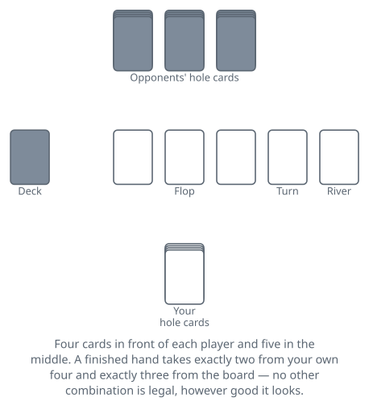
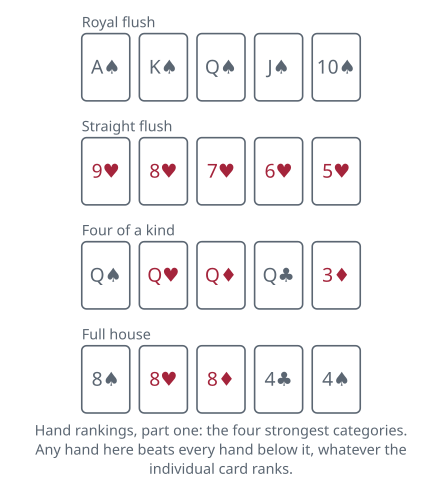
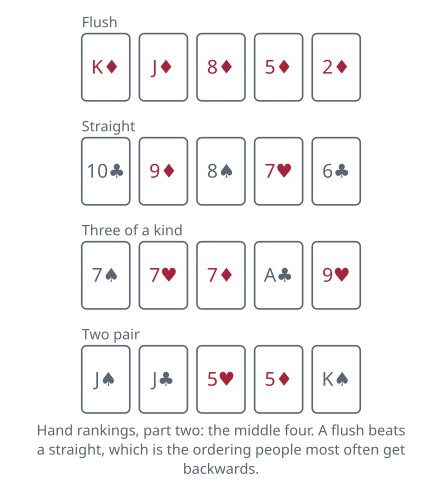
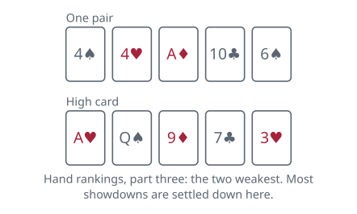
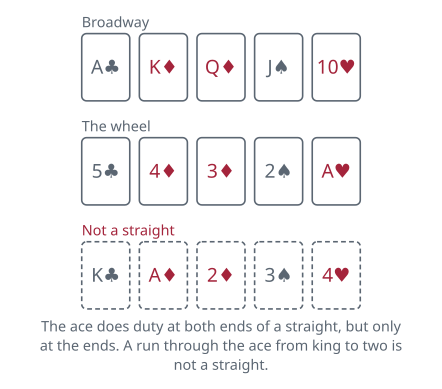

<!-- Generated by packages/build/render-markdown.ts from games/omaha.json. Do not edit by hand. -->

# Omaha

**Also known as:** Omaha Hold'em, Omaha Holdem, Pot-Limit Omaha, PLO  
**Players:** 2-10 players (best with 6)  
**Deck:** 1 standard deck (52 cards), plus chips or counters for everyone  
**Time:** 30-120 minutes  
**Difficulty:** Medium  
**Category:** Bluffing  

## Setup

Four cards each instead of two, and a rule about how many of them may be used. That is the whole difference from the shared-card game most people learn first, and it changes more than it sounds like it should.

Everyone plays from a stack of chips in front of them. What is on the table is what you can lose in a hand and what you can win from anyone else; you never reach into a pocket mid-hand, though between hands you may usually top up to whatever the table allows. Six players makes the standard game and nine or ten fills a table, but it works down to two.

A marker called the button shows who is nominally dealing, and it moves one seat clockwise after every hand. It decides the order everyone speaks in, so moving it is what shares out the advantage of acting late.

Before any card is dealt, the two players clockwise of the button put in forced bets: the small blind first, then the big blind, usually double it. These exist so that the first hand of the night already has something in the middle worth playing for, and they are how stakes get named — a one-two game means blinds of one and two. Heads-up the order inverts, with the button posting the small blind and acting first before the shared cards appear and last after them.

The dealer then gives four cards face down to each player, one at a time clockwise from the small blind. Nobody sees anyone else's until a showdown, and a hand shown at a showdown must be shown in full — all four, not the two that played.

Cards rank ace high, and the ace also serves as the low end of a five-high run. Suits never break a tie. Equal hands split the pot.

## Play

One rule governs everything else, so it comes first. Exactly two of your four cards, and exactly three of the five on the table. Not one, not three, not all four. It is not a maximum and not a minimum, and it applies to every hand you ever make here.

That single sentence is what people misread, and they misread it in the same direction every time. Holding three hearts with two more on the board is not a flush, because only two of yours may play and the board offers only two more. Holding an ace when the board shows four to a straight does not make you that straight either. Read the hand as a fixed shape rather than a pool of seven cards, and it stops catching you out.

A hand runs through four betting rounds, with the dealer turning more shared cards between them.

WHAT YOU CAN DO ON YOUR TURN

- Check. Pass the turn along without staking anything, which is only open to you if nobody has bet yet this round.
- Bet. Be the first to put chips in.
- Call. Match the most anyone has staked this round.
- Raise. Put in more than that, which brings the turn back round to everyone still in.
- Fold. Give the hand up. What you have already staked stays where it is.

A round closes when everyone still holding cards has acted and everyone still in has staked the same amount for that round, all-ins aside. Chips already in the middle are never taken back.

BEFORE THE FLOP

The blinds are live bets, so the round opens on the player clockwise of the big blind, who must at least match it to continue. It runs clockwise and ends on the big blind, who may raise even when nobody else has.

THE FLOP, THE TURN, THE RIVER

The dealer burns a card face down and turns three face up in the middle; a betting round follows. Then a burn and a fourth card, and a round. Then a burn and a fifth, and the last round. From the flop onwards the first player still in clockwise of the button speaks first and the button speaks last.

HOW MUCH YOU MAY BET

Pot limit is the usual structure and the one the game is named for in its commonest form. The ceiling on a bet is what the pot holds; the ceiling on a raise is what the pot would hold once you had called, which is the part worth doing slowly.

Work it in that order. Say the middle holds 50 and someone bets 50, so there is 100 out there. You call the 50 in your head first, making 150, and 150 is what you may raise by. Put in 200 altogether and the pot stands at 300. Repeat that twice and the reason people call pot limit a shove in slow motion is on the table in front of you.

The floor on a raise is the size of the last bet or raise. A short all-in below that does not reopen the betting for anyone who has already acted for the full amount, though it does not restrict a player yet to speak.

All-in works as it does anywhere: you may always put your last chip in, you can win from each opponent only as much as you staked yourself, and anything wagered past that is set aside in a side pot for the players who covered it.

THE SHOWDOWN

If two or more are left after the final round, cards come face up. The last player to bet or raise shows first; if nobody bet, it is the first player clockwise of the button. Beaten hands may be mucked face down rather than shown.

Each player names their best five cards under the two-and-three rule, and a hand in contention has to be shown complete — all four hole cards, including the two that did nothing. A hand can also end long before this: the moment everyone else folds, whoever is left takes the pot without showing anything.

## Goal & scoring

There is no running score. Each hand is a fight over one pot, and there are two ways to take it: hold the best five cards at the showdown, or be the last player who has not folded. Nothing distinguishes the two afterwards — an uncontested pot spends the same.

Hands are compared by the standard poker categories, and within a category by rank, with leftover cards settling near-ties in order. The categories are the ones on the strips above and mean here exactly what they mean everywhere else. What differs is which hands are reachable: because three of your five cards always come off the same board everyone shares, made hands run much bigger than players arriving from a two-card game expect. A flush that would win a Hold'em pot outright is an ordinary holding here, and two players making the same straight is common enough that splitting is a normal outcome rather than a curiosity.

The same board also means nobody can hold a hand the board does not offer. If the five shared cards contain no pair and no three of a suit, then nobody at the table has a full house or a flush, whatever they are representing. Reading what is impossible is most of what separates players here.

Equal hands split the pot; an odd chip goes to the first player clockwise of the button. Where all-ins have built side pots, each is settled on its own among the players who were in it, so a short stack can take the main pot while a stronger hand collects everything above it.

A cash game has no end: chips are stakes, you may join or leave between hands, and your result is whatever is in front of you when you stand up. A tournament ends when one player holds every chip, with equal starting stacks, blinds rising on a clock, and finishing position rather than chip count deciding where you came.

## Variants

**Omaha hi-lo, eight or better** — The pot is divided between the best high hand and the best qualifying low one. A low has to be five cards of different ranks, none higher than an eight, and straights and flushes do not count against it, so the best possible low is A-2-3-4-5 — which is also a straight, and can therefore win both halves at once. The two-and-three rule applies separately to each half, so the two cards making your low need not be the two making your high. When no low qualifies, the high hand takes everything. Sharing half a pot with another low is called being quartered, and it is how a hand that looked strong ends up losing money.

**Five-card Omaha, and Big O** — Five hole cards each rather than four, with the showdown rule untouched: still exactly two from your hand and three from the board. The extra card multiplies the possible two-card combinations from six to ten, which raises the winning hand again and makes the game markedly looser. Played high-only it is usually called five-card Omaha; played hi-lo eight-or-better it is Big O.

**Courchevel** — Five hole cards, and the first of the shared cards is turned face up before the opening bets rather than as part of the flop. Everyone therefore acts before the flop already knowing a fifth of the board, and the flop itself adds only two more cards. Played both high and hi-lo.

**No-limit and fixed-limit Omaha** — The same game with a different ceiling on the betting. Fixed limit, once the standard form, keeps every bet at a set size and caps the raises in a round, which suits hi-lo where hands are often split and building a huge pot serves nobody. No limit exists but is rare, because four cards make strong hands so often that threatening a whole stack loses much of its meaning.

**Tags:** betting, bluffing, large-group, long-game, strategy, two-player

*Rules checked against: Pagat, Wikipedia.*

---

Part of [Naibi](../README.md). Text licensed [CC BY-SA 4.0](../LICENSE).
