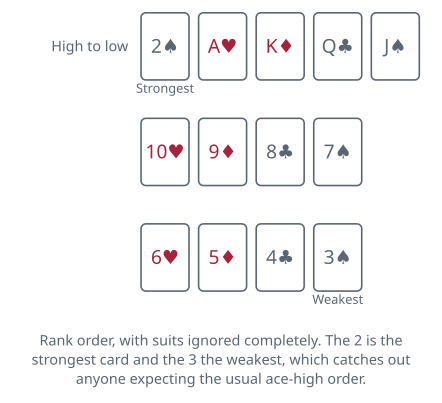
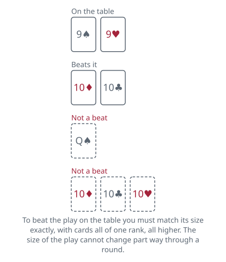

<!-- Generated by packages/build/render-markdown.ts from games/president.json. Do not edit by hand. -->

# President

**Also known as:** Scum, Asshole, Presidents and Assholes, Bum, Rich Man, Poor Man, Capitalism, Landlord, Warlords and Scumbags, Daifugō  
**Players:** 3-8 players (best with 5)  
**Deck:** 1 standard deck (52 cards), jokers usually removed; add a second deck above about seven players  
**Time:** 20-45 minutes  
**Difficulty:** Easy  
**Category:** Shedding  

## Setup

Use a full 52-card pack with the jokers taken out. Suits do nothing at all in this game; only rank matters. The order runs, from strongest down, 2, ace, king, queen, jack, 10, 9, 8, 7, 6, 5, 4, 3. The two is the top card and the three is the bottom one, which catches out anyone expecting the usual ace-high order.

For the opening deal of a session, pick a dealer by drawing cards. Deal the entire pack out one card at a time, clockwise. Unless the player count divides into 52 evenly, some players end up with one card more than others, and that is simply accepted rather than corrected. Nobody has a stock or a discard pile of their own; everything is in hand.

The first hand of a session starts with the player to the dealer's left, since no social ranks exist yet. A common alternative is that whoever holds the three of clubs must lead it as the first play.

Every hand after the first begins with an exchange and, usually, a reshuffle of the seating. Once the ranks exist, players sit in order around the table: the President takes the best chair, the Vice-President sits to their left, then the Citizens, with the Vice-Scum and finally the Scum on the President's right. The Scum collects, shuffles and deals the cards for the next hand, which is part of the point of being the Scum.

Add a second pack once you get past about seven players so hands do not shrink to nothing.

## Play

The player who leads may put down any single card, or any set of cards of the same rank from their hand: two fives, three jacks, four sevens. Suits are ignored, so a pair is just two cards of matching rank. Whatever the leader plays sets the size of that round.

Going clockwise, each player in turn must either pass or beat the play on the table. To beat it you must put down the same number of cards as the lead, all of the same rank as each other, and of a higher rank than the cards currently on top. A single nine is beaten by a single ten or higher. A pair of nines can only be beaten by a higher pair, never by a single card and never by three of a kind. The size of the play cannot be changed part way through a round.

In the standard game passing is always allowed even when you could legally play, and passing does not shut you out. If the round comes back to you, you may play again. A great many groups play the stricter version in which a pass takes you out of the round for good, so agree on this before you deal; it makes a real difference to how you hold your twos.

Play keeps circling the table for as long as somebody can top what is showing. The moment it runs the full way round without anyone beating the play on top, that play has taken the round. Those cards are finished with: flip the whole lot over, push it clear of the playing area, and it takes no further part in the hand. Whoever owned the winning play now opens the next round, free to lead a single, a pair or any larger set they fancy. If that same play happened to empty their hand, the opening passes clockwise to the nearest player who still has cards.

You are out as soon as you play your final card or cards, and you take the highest social rank still unclaimed. The first player out is the President, the second is the Vice-President, everybody in between is a Citizen or Neutral, the second-to-last is the Vice-Scum, and the very last player, left sitting with cards nobody wanted, is the Scum. Some groups stop the hand the moment the Scum is the only player left; others make them play their remaining cards out for the entertainment value. It makes no difference to the result.

Before the next hand is played, the ranks pay out. Whoever finished as Scum must surrender their two strongest cards to the President, strongest by the actual rank order, with no quietly holding a two back. In return the President passes down two cards of their own choosing, in practice their two least useful; there is no rule against sending back exactly what just arrived, odd as that would look. One card each moves the same way between the Vice-Scum and the Vice-President. Anyone ranked Citizen neither gives nor receives. In a three-handed game the Vice tier does not exist, so only the President and the Scum swap, two cards each way. All of this is settled once the cards are dealt and before the first lead.

Once the exchange is settled, the President leads to the first round of the hand. Some groups instead give the opening lead to the Scum as a small consolation. Either convention works as long as everyone uses the same one.

## Goal & scoring

The immediate goal in each hand is to shed your cards before everyone else and come out as President. The longer-term goal is to stay at the top, because the card exchange means the President starts each new hand with better cards than they were dealt and the Scum starts with worse. Most groups play with no written score at all: the game is about holding the President's chair, and it ends when people have had enough.

If you want a score, the usual method is to award 2 points for President, 1 for Vice-President, 0 for each Citizen, and nothing to the Vice-Scum, with the Scum sometimes charged -1. Play a fixed number of hands, or to a target such as 11 points, and the highest total wins. Playing an agreed number of hands rather than to a target is fairer, since the last few hands otherwise favour whoever is already President. Break a tie on points by counting who took the President's chair more often over the session, and if that is level too, play one more hand and let it settle the matter.

Two details worth settling early. A player who goes out on their last play still ranks ahead of anyone still holding cards regardless of how the rest of the round finishes. And if two hands in a row leave the same person as Scum, some groups apply an extra penalty such as a three-card exchange, while others leave it alone.

## Variants

**Passing locks you out** — Once you pass, you are finished for that round and cannot play again until the pile is cleared and a fresh lead is made. This is probably the more widely played version, particularly in North America, and it is closer to how the Chinese and Vietnamese climbing games in the same family work. It rewards patience: holding a two back becomes far more valuable when a single pass cannot be taken back, and a player who is running low on cards can be frozen out of a round with a well-timed high play.

**Bombs and revolution** — Four of a kind, played all at once, is a bomb. Depending on the group it either clears the pile immediately, letting the bomber lead again, or it turns the entire rank order upside down for the rest of the hand so that threes become the strongest card and twos the weakest. A second four of a kind restores the normal order. Some tables run a lighter version in which any single two, or a set of twos, clears the pile on its own without having to beat what is on the table.

**Completing the set clears the pile** — If your play makes four cards of the same rank sit on top of the pile, counting what previous players contributed rather than just your own cards, the pile is swept away at once and you lead the next round. Playing a pair of kings onto a pair of kings does it. This adds a lot of tactical bite, because it gives a low-ranked player a way to seize the lead without owning the highest cards, and it makes people think twice about splitting a set.

**Daifugō (Dai Hinmin)** — The Japanese game that President descends from, still widely played and considerably more developed. Jokers are included as wild cards. Playing an eight clears the pile immediately, the rule known as eight-cut, and the player who did it leads again. Four of a kind triggers a revolution that reverses the rank order, and a second one reverses it back. Sequence runs of three or more cards in the same suit can be played as a unit in some versions. Several rules ban going out on a two, a joker or an eight, so a hand that ends on one of those forces the player to take the bottom rank instead of the top.

**Table rules and the party version** — The reason the game is more often called Asshole than President. The Scum shuffles, deals, clears the pile between rounds, and fetches drinks. The President may invent a rule that holds until they are dethroned, commonly something like a ban on using players' real names or on speaking out of turn. Breaking a rule costs a drink, and so does being caught with a card you should have played. None of this touches the underlying card game, but it is how most people actually encounter it.

**Tags:** beginner-friendly, classic, large-group, party, strategy

*Rules verified against: Pagat, Wikipedia, Bicycle Cards, Britannica, Game Rules, Official Game Rules, Cats at Cards, Gambiter, Denexa Games. This write-up is original text, not reproduced from those sources.*

---

Part of [Naibi](../README.md). Text licensed [CC BY-SA 4.0](../LICENSE).
