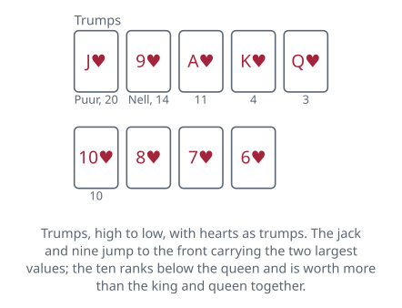
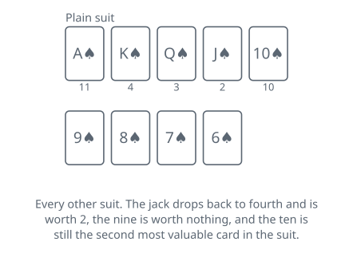
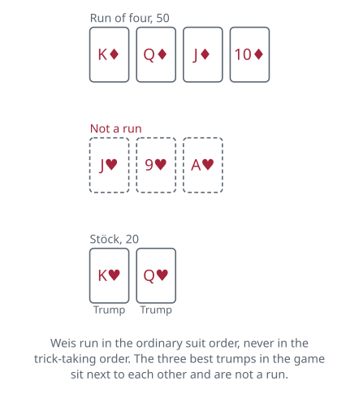

<!-- Generated by packages/build/render-markdown.ts from games/schieber-jass.json. Do not edit by hand. -->

# Schieber Jass

**Also known as:** Schieber, Chibre  
**Players:** 4 players  
**Deck:** 1 standard deck stripped to 36 cards (A, K, Q, J, 10, 9, 8, 7, 6 in each suit)  
**Time:** 45-90 minutes  
**Difficulty:** Complex  
**Category:** Trick-taking  

## Setup

Jass is a whole family of Swiss games rather than one game, and Schieber is the branch of it most tables mean when they sit down without saying which. Four players in fixed partnerships, partners opposite each other. The name comes from schieben, to push: the one decision each hand turns on can be pushed across the table to your partner, who then has to make it.

The pack is thirty-six cards, an ordinary deck with everything below the six taken out. Swiss packs come in two designs and the country is split down the middle over them — Swiss-German suits of roses, bells, acorns and shields in the east and centre, French suits in the west and south — but the game is the same and any 36-card pack plays it. Swiss cards call the queen an Ober, the jack an Under and the ten a Banner, and those names turn up in the rules whichever pack is on the table.

Two rankings and two sets of card values, and none of it is negotiable:

- A plain suit runs ace, king, queen, jack, ten, nine, eight, seven, six, and the ten counts 10 while the jack counts 2, so its fifth-highest card is its second most valuable.
- In trumps the jack leaps to the top as the Puur, worth 20, and the nine follows it as the Nell, worth 14. The rest keep their order and their values underneath: ace 11, king 4, queen 3, ten 10, and nothing for the eight, seven and six.

That puts 62 points in the trump suit and 30 in each of the others. Add 5 for whoever takes the last trick and every deal is worth 157.

Deal and play run to the right, anticlockwise. Anybody may deal the first hand; after that the deal moves one seat right each time. Who gets the first hand's choice of contract is a table custom rather than a rule — cut for it, or hand it to whoever is dealt a nominated seven — and from the second hand on it is simply the seat to the dealer's right. Deal all thirty-six cards out in packets of three, starting with the player on the dealer's right, so everyone holds nine and nothing is left over.

Score on a slate if you have one, which is how it is done in Switzerland — a Z drawn on it, hundreds along the top, fifties on the diagonal, twenties along the bottom. A sheet of paper loses nothing but the atmosphere.

## Play

Choosing the game. Forehand — the player to the dealer's right — either names what is played or pushes the choice to their partner, who must then name it. Nobody bids and nothing is contested: the choice is a privilege attached to a seat, and it moves one seat right each deal. What may be named:

- Any of the four suits as trumps.
- Obenabe, no trumps and every suit ranking downward from the ace.
- Undenufe, no trumps and every suit ranking upward from the six, so the six is the best card in it and the ace the worst. Most tables now move the 11 points across with it, making the six worth 11 and the ace nothing, and some of those let four sixes stand as a Weis in place of four aces. Older Swiss practice, and the Vorarlberg and South Tyrol forms, leave the values where they are; ask.

With no trump suit there is no Puur and no Nell, so 32 points go missing. The four eights make them up, counting 8 each instead of nothing, and the deal is worth 157 again.

Whatever you chose then sets a factor, and every point your side collects that deal is multiplied by it — the Weis and the Stöck exactly as much as the card points. The table has the figures. Two of the four suits are worth double, which is what makes choosing a live decision rather than a formality. On a Swiss pack those two are shields and bells; on a French pack the usual convention hands the doubling to the two black suits, but the sources genuinely disagree about it, so settle which two before the first deal.

The tricks. Forehand leads to the first one; from then on the lead belongs to whoever took the last. The following rule is the one that marks these games out from the whist family, and it is worth reading twice: holding the suit led, you may either follow it or play a trump, as you please. There is never any obligation to follow a plain suit when a trump would suit you better.

What is forbidden instead is undertrumping. Once somebody has trumped a plain suit, nobody after them may drop a smaller trump onto it to be rid of the card. If you can follow the suit led, your choice narrows to following it or beating that trump; if you cannot follow, you may play anything at all except a trump that fails to beat it. A player holding nothing but trumps is released from all of that and may play any of them.

Two more:

- When trumps are led you must play one if you have one, with a single exception, and it is a valuable one: if the Puur is the only trump left in your hand, you may hold on to it and play anything else instead.
- The trick belongs to the highest trump on it, and where no trump was played, to whoever went highest in the suit that opened.

Nine tricks empty the hands. Taking all nine is a match and pays 100 above the 157, before the multiplier.

Weis. Combinations held at the start of play score, and only one side collects them. A run of three or more cards in one suit counts, and so does four of a kind in ace, king, queen or ten, with four jacks the best thing in the game at 200. The trap is that Weis are read in the ordinary suit order, ace down to six, which has nothing to do with the trick-taking order — the Puur, the Nell and the ace of trumps are the three best cards you can hold and they are not a run.

The collecting is settled over the first trick. As each player plays their card they may name the value of their best Weis; whoever is beaten says so, and where two claims are level the players compare length, then top card, then trump, then seating order, giving away as little as they can while they do it. The side owning the best single Weis scores every Weis on that side, and the other side scores none of its own however good they were. Anybody may ask to see a scored Weis before the second trick.

Stöck sits outside all of that. Hold the king and queen of trumps and you say stöck as you play the second of them, for 20, and it cannot be beaten or cancelled by anybody's Weis.

## Goal & scoring

Each side counts the card points in its tricks, whoever took the last trick adds 5, and the two totals must come to 157. A side that took all nine holds all 157 and adds another 100 for the match, making 257. Apply the contract's factor to that, and add whatever Weis and Stöck went onto the slate earlier — those were multiplied by the same figure when they were written down — and the deal is finished.

Nobody has to make anything. There is no contract to fail and no penalty for choosing badly — a bad choice simply hands the opponents a large score at your multiplier, which is punishment enough.

The target is agreed before the first deal, and this is the one number the sources genuinely differ on. Where the multipliers are in use, 2500 is the usual figure and some rule sets say 3000; where every contract counts single, 1000. A game to 3000 typically runs about a dozen hands.

Crossing the line is a move rather than an event. A side that believes it has arrived must say so — the Swiss verb is sich bedanken, to give thanks — and the game stops there, in the middle of a hand if need be. Claim correctly and you have won, even if the opponents were about to pass you. Forget to claim and you have not won yet. Claim without the points and you lose on the spot, so count the slate before you open your mouth.

Which leaves the case where both sides could cross on the same trick, and this is what the three scoring elements are named in order for. Stöck, Wiis, Stich — marriage, melds, tricks — is the commonest Swiss answer: count the Stöck first, and if that takes a side to the target it has won; then the Weis; then the trick. Stöck-Stich-Wiis is also played, and Vorarlberg tends to put the trick first. Swiss cafés that keep cards behind the bar often have their order posted on the wall, which tells you how often it comes up.

| Scores | Value | Notes |
| --- | --- | --- |
| Jack of trumps (Puur) | 20 | — |
| Nine of trumps (Nell) | 14 | — |
| Ace, any suit | 11 | in Undenufe, most tables give this 11 to the six and the ace nothing |
| Ten, any suit | 10 | — |
| King, any suit | 4 | — |
| Queen, any suit | 3 | — |
| Jack, not trump | 2 | — |
| Nine not trump, and all eights, sevens and sixes | 0 | — |
| Each eight, in Obenabe and Undenufe | 8 | replaces the missing Puur and Nell, keeping the deal at 157 |
| Last trick | 5 | 157 on the table every deal |
| Match, all nine tricks | +100 | — |
| Stöck (king and queen of trumps) | 20 | never contested by anyone's Weis |
| Run of three | 20 | — |
| Run of four | 50 | — |
| Run of five or more | 100 | — |
| Four aces, kings, queens or tens | 100 | — |
| Four nines | 150 | only if agreed beforehand; many tables do not allow it |
| Four jacks | 200 | — |
| Roses or acorns as trumps | x1 | — |
| Shields or bells as trumps | x2 | with a French pack, usually the two black suits |
| Obenabe | x3 | — |
| Undenufe | x4 | multipliers apply to tricks, Weis and Stöck alike |

## Variants

**Everything single** — Drop the multipliers and score every contract at face value, which lowers the target to 1000 and takes the arithmetic out of the choice. Choosing then becomes purely a question of which contract your hand plays best in, rather than of gambling a weak hand at four times the stake because Undenufe was worth it. It is the easier version to learn the game on.

**Coiffeur Schieber** — The other direction entirely, and enough of a game in its own right that it is usually written up separately. The contracts become a grid: each side has eight to get through, sixteen deals in all, and a contract once played is crossed off and unavailable for the rest of the session. Each carries its own multiplier from one to eight, rising through the suits to Obenabe, Undenufe and two jokers, and the score for a hand is the card points divided by ten with the units thrown away, times that multiplier. Since you cannot keep choosing what suits your hand, the question becomes which remaining box to spend a mediocre one on — which is what the name puns at, coiffeur for quoi faire, what on earth do I do.

**Shoving back** — Some tables let a partner who has been pushed to push it straight back, which forces forehand to choose after all. It sounds like a joke and is not: the first push says nothing more than that your hand is unremarkable, and the second says the same thing louder, so the pair have swapped a decision for a small amount of genuine information.

**Large Weis** — An extended schedule, promoted by the modern Swiss rulebook Puur-Näll-As, which public Schieber tournaments now largely follow. Long runs go on scoring past five — 150 for six, 200 for seven, 250 for eight, 300 for nine — and, unlike the ordinary schedule, one card may count in a four of a kind and in a run at the same time, so four kings alongside a run through one of them score both rather than the better of the two.

**Bergpreis** — A consolation prize for reaching the halfway mark first — 1500 in a 3000-point game, 500 in a 1000-point one. The metaphor is a bicycle race: the first side up the mountain takes the climb, and the game is still decided by whoever gets down the far side. It changes nothing about the play and gives a side that is being beaten something to hold on to.

## Background

Jass reached Switzerland from the Low Countries and was first recorded there in 1796, when the word meant the highest trump — the jack — rather than the game. It has since taken over the language: the 36-card packs are Jasskarten, and the Swiss will call almost any card game played with them a Jass. There are said to be more than seventy variants, of which Schieber is the one most people play, and the game is regular television, with weekly Jass programmes on Swiss national broadcasting.

The two pack designs mark a real cultural line. Swiss-German suits are used east of a boundary running through the Brünig pass, the Napf and the Reuss, and French suits west and south of it, so which cards are on the table says roughly where you are. The game travelled with the language rather than the border, and is played in Liechtenstein, Vorarlberg, Alsace, South Tyrol and the southern edge of Baden-Württemberg, along with pockets of the United States — Wisconsin and Ohio among them.

Belote, also in this collection, is a French relative from the same branch of the family, which is why its jack and nine of trumps are worth 20 and 14 as well.

**Tags:** classic, counting, long-game, partnership, strategy

*Rules checked against: Pagat, Wikipedia, Wikipedia (German).*

---

Part of [Naibi](../README.md). Text licensed [CC BY-SA 4.0](../LICENSE).
