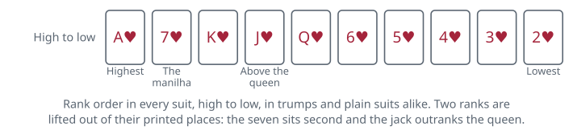

<!-- Generated by packages/build/render-markdown.ts from games/sueca.json. Do not edit by hand. -->

# Sueca

**Players:** 4 players  
**Deck:** 1 standard deck stripped to 40 cards (A, 7, K, J, Q, 6, 5, 4, 3, 2 in each suit)  
**Time:** 20-45 minutes  
**Difficulty:** Easy  
**Category:** Trick-taking  

## Setup

Sueca is the national card game of Portugal and is played in Brazil, Angola and wherever else Portuguese is spoken. It is for four and only four, in two fixed partnerships, partners sitting opposite one another.

Take an ordinary pack, drop the jokers and pull out every eight, nine and ten. Forty cards remain. Deal and play go counter-clockwise in Portugal, so cards move to the dealer's right and the deal passes right after each hand; in Brazil the whole rotation is reversed and everything runs to the left instead.

Choose the first dealer by cutting, low card taking it. The player on the dealer's left cuts the shuffled pack, and then the whole of it is dealt — ten cards to each player, beginning with the player on the dealer's right. Portuguese custom is to hand them out in one block of ten rather than singly, which is quick and, since every card is dealt anyway, gives nothing away. Trumps are not chosen by anybody; they fall out of the deal itself. Whichever card comes off the bottom of the pack is the dealer's tenth, and rather than going quietly into the dealer's hand it is exposed to the table first, the suit on its face governing the entire deal. The dealer then picks it up and holds it like any other card. Some tables would rather it stayed face up in front of the dealer until the moment it is actually played. Either way the suit is public and the card is the dealer's to play, but say which before the first deal so that nobody thinks a card is being concealed. Nothing is left over, there is no stock and no bidding, so within a few seconds of the shuffle everybody is looking at a complete hand and a known trump suit.

Two things then need to be in your head. The first is the ranking, which is not the order printed on the cards and cannot be worked out from them: it is arranged so that the two cards carrying the heaviest point values are also the two that win tricks, which means the cards you most want are the cards hardest to take. The second is that the pack is worth 120 in all and each suit carries thirty of it, so the counters are spread evenly and there is no cheap suit to attack.

Unusually for a partnership game of this family, there is no signalling tradition here. Portuguese practice bans it outright: no table talk, no faces, nothing but the cards.

## Play

The player to the dealer's right leads to the first trick, and the winner of each trick leads to the next.

Follow suit if you can. That single restriction is the whole of the law: a player holding the suit that was led must play one, and only a player void in it is free to do anything else. There is no obligation to trump when you are void, and no obligation to beat what is already on the table. Throwing a worthless card away is always allowed once you cannot follow.

A trick goes to the highest trump in it, or, if nobody trumped, to the highest card of the suit led. The winning side gathers it face down; some tables let one player of each partnership keep all their tricks and count at the end, others stack them in the middle of the table in front of the pair.

Ten tricks exhaust the hands and the deal is over.

Because every card is dealt and the trump card was shown, nothing is hidden except the distribution across the three hands you cannot see. Good players work it out from the discards, and this is where the ban on signals bites: the only way to tell your partner that you are out of hearts and full of trumps is to demonstrate it, which necessarily tells the opponents too. Leading a suit your partner can ruff, or leading trumps early to strip them from the opposition before the aces and sevens come out, are the two standard plans.

Revoking — failing to follow suit when you held the suit — is treated seriously. The moment it is spotted the deal stops. Most groups treat the offence as a renúncia and award the whole four-game rubber to the innocent side there and then; a milder convention charges two games instead. Agree which one applies before anybody deals, because under the harsher rule a single careless card can end the entire session.

## Goal & scoring

Card points are what the tricks are for. When the last trick is played each partnership counts the value of everything it captured, and the two figures must total 120; if they do not, the count has gone wrong somewhere and has to be redone.

The deal is then converted into games, which is the currency the match is actually played in:

- 61 to 90 card points: 1 game.
- 91 to 120 card points without taking every trick: 2 games. Including 120 itself, which is not a misprint. Twenty of the forty cards carry no value whatever, so a trick built entirely out of them can be conceded without denting the total; a side in that position holds the maximum score and has still not taken all ten tricks, and its deal is worth two games rather than four.
- All ten tricks — a bandeira, literally a flag: 4 games, which wins the match outright whatever the score stood at before.
- Exactly 60 apiece: no game to either side, and the deal is simply forgotten.

Four games make a rubber and win the match. Since a strong deal pays double, a side can come from nothing to victory in two hands, and since the flag pays the whole rubber at once, a partnership holding a run of trumps has something worth going for beyond mere safety.

Sources disagree on one edge case: whether the four-game flag is earned by winning all ten tricks or by capturing all 120 card points, which are not quite the same thing, since a trick containing no counters can be lost without costing a point. Taking all ten tricks is the more widely stated requirement, and it is the cleaner rule to adopt.

Beyond 61 the incentive changes shape. A side already sure of the deal should be pushing for 91 rather than coasting, because the second game is worth exactly as much as the first and is often only one ace away.

| Scores | Value | Notes |
| --- | --- | --- |
| Each ace | 11 | — |
| Each seven (manilha) | 10 | — |
| Each king | 4 | — |
| Each jack | 3 | — |
| Each queen | 2 | — |
| Six down to two | 0 | — |
| Each suit | 30 | 120 in the pack, evenly spread |

## Variants

**Brazilian rotation** — The Brazilian form reverses the table: the deal, the passing of the deal and the order of play all run clockwise rather than counter-clockwise, so the first cards and the opening lead go to the dealer's left. Nothing else changes, but a Portuguese player dropped into a Brazilian game will lead out of turn at least once.

**Sueca Italiana** — An Italian reworking that bolts an auction onto the front. Players bid, and the winner names both the trump suit and a card they do not hold; whoever has that card becomes their partner without announcing it, so the partnerships are not the seating and stay concealed until the called card appears. The shape is closer to the five-handed Italian calling games than to Sueca proper.

**Bisca** — The wider Portuguese family Sueca belongs to, and the way to play when there are not exactly four of you. Bisca games keep a stock: fewer cards are dealt, a trump is turned, and players draw back up to a full hand after every trick until the pack is exhausted. Versions exist for two, three, four and six players, and someone who knows Sueca can pick any of them up in a minute.

**Fixed match length** — Rather than racing to four games, some groups agree a number of deals in advance — often eight or twelve, so that every player deals the same number of times — and total the games at the end. It removes the sudden death of the flag and stops a match ending three minutes after it started, at the cost of the tension that makes the rubber worth playing.

**Tags:** classic, counting, family-friendly, partnership, strategy

*Rules verified against: Pagat, Wikipedia, Ludoteka, Gambiter, GameRules.com, GameVelvet. This write-up is original text, not reproduced from those sources.*

---

Part of [Naibi](../README.md). Text licensed [CC BY-SA 4.0](../LICENSE).
