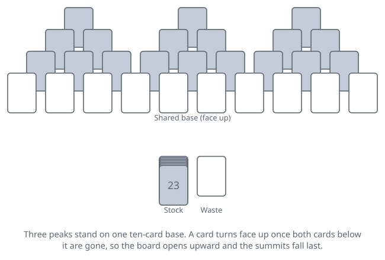
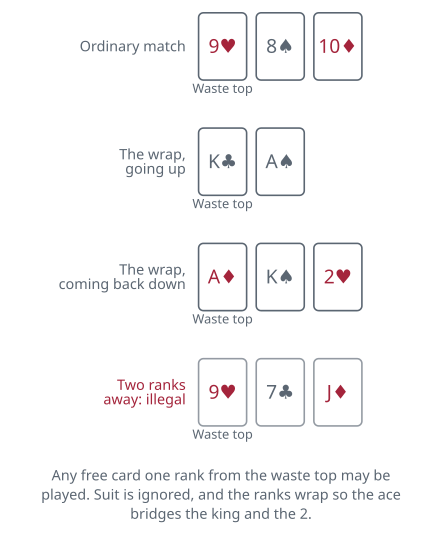

<!-- Generated by packages/build/render-markdown.ts from games/tripeaks.json. Do not edit by hand. -->

# TriPeaks

**Also known as:** Tri Peaks, Three Peaks, Triple Peaks, Tri Towers  
**Players:** 1 player  
**Deck:** 1 standard deck (52 cards)  
**Time:** 5-15 minutes  
**Difficulty:** Simple  
**Category:** Solitaire (1 player)  

## Setup

Shuffle a full 52-card deck and build three peaks that share a single base. Start with three separated cards along the top, one for each peak. Beneath them place a row of six, two tucked under each summit so that each summit rests on both. Beneath that a row of nine, three under each peak. Finally a row of ten running the full width of the layout, and this is where the peaks interlock: the fourth and seventh cards of the bottom row each help support two neighbouring peaks at once.

That is 28 cards. Deal the first three rows face down and the bottom row of ten face up, so eighteen cards start hidden.

Of the 24 cards remaining, turn one face up beside the peaks to open the waste pile. The other 23 sit face down as the stock. Ranks matter and suits never do, so there is no need to keep the layout tidy by colour.

## Play

A card is playable only when nothing overlaps it. The ten cards of the base are free from the start; every other card is pinned by the two cards below it and turns face up the instant the second of those leaves.

The move is one rule. Take any free card whose rank is one step from the card showing on the waste and lay it on the waste, where it becomes the new target. Suit is irrelevant; rank is the whole question. With a 9 showing, any free 8 and any free 10 are yours, and whichever you take is what the next card must match.

Ranks run in a circle for this purpose. The ace sits between the king and the 2, so a king may be played onto an ace and an ace onto a king. That hinge is what turns a chain of four cards into a chain of a dozen, and it is the rule worth agreeing before you deal: the original game allows it and nearly every computer version follows, while stricter rule sets stop the sequence dead at the king and lose a noticeable share of otherwise winnable deals by doing so.

When nothing on the table matches, turn the top stock card face up onto the waste. It becomes the new target whether it suits you or not. There are 23 of those turns and no more. The waste is never turned over, never reshuffled, and a card buried in it is finished for the deal.

Drawing is never forced and never has to wait until you are stuck, so you can spend a draw to escape a position you dislike. The whole game lives in the moments when two or more free cards would both be legal: take the wrong one and the other is stranded, costing you a draw you will want back. Looking one card ahead is rarely enough. The players who clear peaks are the ones working out which card has to go now to release the card sitting on top of it.

The deal ends when the last of the 28 peak cards reaches the waste, which is a win, or when the stock is empty and no free card matches, which is a loss. Cards still in the stock at the finish are simply ignored.

## Goal & scoring

You win by clearing all 28 cards of the three peaks onto the waste. Whatever is left in the stock does not count, so the last peak card ends the deal on the spot.

The original scoring is built around one idea: consecutive removals. A run of cards taken without touching the stock is called a streak, and each card in a streak is worth more than the one before it, so the value of a chain climbs steeply the longer you keep it alive. Drawing from the stock breaks the run and the count restarts. Clearing a peak pays a bonus on top, and the peak that finishes the deal pays double what the earlier two pay. The system was tuned so that a player who builds chains, rather than grabbing whichever card is legal first, comes out ahead across a session — which is why the wrap at the ace is worth so much more than it looks.

Commercial versions layer their own arrangements over this, commonly a clock, a deduction for each draw, or a penalty for cards left standing if you concede. None of that belongs to the original game.

Most deals can be cleared. Solvability with the wrap allowed is usually quoted above 90 percent, and one exact-solver run over about a thousand deals put it near 97, while ordinary players report winning around half their games. That gap is not luck. It is the price of spending draws in the wrong order.

| Scores | Value | Notes |
| --- | --- | --- |
| First card of a streak | 1 | — |
| Second card of the same streak | 2 | — |
| Each card after that | 3, then 4, then 5, upward | — |
| Drawing from the stock | 0 | Breaks the streak; the next card removed scores 1 again. |
| A seven-card streak, all told | 28 | One plus two on up to seven, against 7 for the same cards taken singly. |
| Clearing the first peak | 15 | — |
| Clearing the second peak | 15 | — |
| Clearing the third peak | 30 | — |

## Variants

**Strict ranking, no wrap** — The ace is treated as the bottom of the order rather than a hinge, so it plays only beside a 2 and the king plays only beside a queen. Nothing else changes, and the two rule sets look identical until the first king turns up. Closing the wrap cuts off the long chains the scoring is built around and converts a fair number of clearable deals into dead ends, which is why almost every published version leaves it open.

**Double TriPeaks** — Two decks and two full peak layouts side by side, 56 tableau cards in all, with the 48 cards left over feeding one shared waste and one shared stock: turn one up to start the waste and 47 remain to draw, so you get 47 draws rather than 23. The matching rule, the wrap and the face-down pattern are untouched, and all six peaks must come down to win. Roughly twice the board with roughly twice the draws, so it plays longer than the single game without being much harder per card. Sold under names including Six Peaks and Two Deck TriPeaks.

**Golf** — The older and plainer relative. Thirty-five cards go face up into seven columns of five with nothing hidden at all, and the same one-rank-either-way rule sends an exposed card to the waste. Traditional Golf does not wrap at the ace, which is the main reason it is the harder game despite showing you everything on the table from the start.

**Tags:** beginner-friendly, classic, family-friendly, luck, quick, solo, strategy

*Rules checked against: Wikipedia, Semicolon Solitaire Rules, BVS Solitaire, Solitaire Association, TrySolitaire, Solitaire Bliss, Solitaire Network.*

---

Part of [Naibi](../README.md). Text licensed [CC BY-SA 4.0](../LICENSE).
