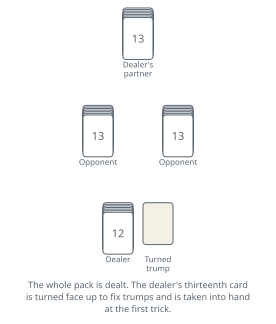

<!-- Generated by packages/build/render-markdown.ts from games/whist.json. Do not edit by hand. -->

# Whist

**Also known as:** Straight Whist, Partnership Whist, English Whist  
**Players:** 4 players  
**Deck:** 1 standard deck (52 cards), jokers removed  
**Time:** 30-60 minutes  
**Difficulty:** Simple  
**Category:** Trick-taking  

## Setup

Whist is for exactly four players in two fixed partnerships, partners sitting opposite each other. Use a 52-card pack with the jokers taken out. In play the cards rank ace high down to 2 low.

Draw for partners and for the first deal at the same time. Spread the pack face down and have everyone take a card, counting the ace as low for this purpose only. The two lowest cards play against the two highest, and the lowest card of all deals first. Anyone who draws a duplicate rank or the bottom card of the pack draws again. After the first hand the deal moves one seat to the left.

The dealer shuffles, the player to the dealer's right cuts, and the whole pack is dealt out one card at a time clockwise, starting with the player on the dealer's left, so each hand holds 13. The final card of the deal, which belongs to the dealer, is turned face up on the table instead of being tucked into the hand. Its suit is trumps for that hand. It stays face up where everyone can see it until the dealer plays to the first trick, at which point the dealer takes it into hand and it becomes an ordinary card. From that moment on, remembering what it was is your own problem.

There is no bidding, no exchange of cards and no stock. As soon as the trump is turned, play begins.

## Play

The player to the dealer's left leads any card at all to the first trick. Play then goes clockwise, one card from each player.

You must follow the suit that was led if you hold a card in it. Only when you are void may you play something else, and then you may play anything: a card of a third suit, which cannot win, or a trump, which can. A trick is taken by the highest trump in it, or if no trump was played, by the highest card of the suit led. The winner of the trick leads to the next one. All thirteen tricks are played out; there is no way to end a hand early, no concession and no discard pile.

How the tricks are stored matters more than beginners expect. One player from each partnership gathers every trick that side wins and stacks them face down in front of them, squared up and countable, rather than scattering them. Once a trick has been turned over and covered by the next one it is closed, and you are not allowed to look back through earlier tricks. Remembering what has gone is the whole skill of the game. Tables vary on whether the trick just completed may be re-examined before the next card is led; the strict rule is that only the trick currently in progress is public.

There is nothing to say during a hand. Whist is deliberately silent: no signalling, no remarks about your holding, no reaction to a partner's card. The turned trump and the fall of the cards are the only information anyone is entitled to, and drawing inferences from them is what you are there to do.

Playing off-suit when you could have followed suit is a revoke. It becomes established once the offending side has led or played to the following trick, and it has to be claimed before the cards are gathered and cut for the next deal. The non-offending side then picks one of three remedies: take three of the offenders' tricks and add them to their own pile, add 3 points to their own score, or take 3 points off the offenders'. Whichever is chosen, the revoking side cannot win the game on that deal, so a revoke made while sitting on 4 points in a 5-point game is expensive twice over. A revoke spotted and corrected before the trick is turned is usually just fixed on the spot, with the withdrawn card left face up as information for the opponents.

When the thirteenth trick is done, each side counts the tricks it won and the deal is scored. The deal then passes one seat to the left and the next hand is dealt.

## Goal & scoring

Six tricks is the book and is worth nothing at all. Only tricks beyond six count, at 1 point each, which means a single hand is worth at most 7 points and only one side can ever take trick points from a given deal.

A game is 5 points in the standard British short whist. American play traditionally used 7 and dropped honours altogether, while the older long whist ran to 10, which is where the game's reputation for endless sessions comes from. Whichever target you use, a rubber is the best of three games: the first side to win two games takes the rubber and adds 2 bonus points. If one side wins the first two games the third is not played. The rubber is settled by the difference between the two sides' point totals once the bonus is added.

Honours are the ace, king, queen and jack of the trump suit, and what counts is where they were dealt, not who captured them during play. Add up what the two partners held once the hand is over: holding three of them pays the pair 2 extra points, and holding the lot pays 4. Two limits apply. Trick points are always counted before honours, so a side that reaches the target on tricks wins immediately. And a side already standing at 4 points towards a 5-point game may not score honours at all, on the principle that you should not be carried over the line by cards you merely held. Because tricks are settled before honours and only one side can score tricks in a deal, a game can never finish level: whichever side reaches the target on tricks has already won before any honours are added.

Many modern groups drop honours entirely and score tricks only, which makes the game a cleaner test of play. Decide which you are using before the first deal.

## Variants

**Bid Whist** — The American partnership game built on whist, played hard and fast. Both jokers join the pack as a big and a little joker, each player is dealt 12 cards and six go face down as the kitty. Bidding runs from 3 to 7, meaning tricks above the book of six, and the winning bidder names trump or no-trump plus a direction: uptown, with the ranks in their usual order, or downtown, with them inverted so that after the ace the 2 is the strongest card and the king the weakest. The high bidder takes the kitty into hand and buries six cards face down; in the usual house rule those buried cards are credited to the bidding side as one trick. Scoring is one-sided: the bidding side takes 1 point for each trick it wins above the book when it makes its contract and loses the full value of its bid when it is set, while the defenders normally score nothing and are playing purely to set the bid. Game is 7 points, and a side driven to minus 7 loses outright.

**Knock-Out Whist** — A short elimination game for three to seven players and a staple of British family card play. The first hand is seven cards each, with the top card of the undealt remainder turned to set trump. Tricks are played as in ordinary whist, but nothing is scored: any player who wins no tricks at all is knocked out. The player who took the most tricks deals the next hand, names trump outright after looking at their cards instead of turning one, and leads to the first trick, with ties for most tricks settled by a cut of the pack. Hands shrink by one card every round, seven down to one, and the last player standing wins. A common kindness is the dog's life, which lets the very first player eliminated stay in with a single card each round, played to whichever trick they choose.

**German Whist** — The two-player version, and the best-known one. Deal 13 cards each and put the remaining 26 face down as a stock with the top card turned up; its suit is trump for the entire hand. The first thirteen tricks are played for the stock rather than for score: the winner of each trick takes the exposed card, the loser takes the next card unseen, and a fresh card is turned. When the stock is exhausted both players hold 13 known-quality cards and play them out, and only these last thirteen tricks count, at 1 point for each trick above six. The first half is a card-drafting duel, the second half is pure technique.

**Solo Whist** — Four players, but each hand becomes an auction of individual contracts rather than a partnership affair. Cards are dealt in batches of three, then a final four, with the last card turned for trump. The bids in ascending order are: a proposal to take eight tricks with whoever accepts it, solo for five tricks alone in the turned trump, misere for losing every trick with no trump, abundance for nine tricks alone with a trump suit of your own choosing, royal abundance for the same nine tricks but in the suit that was turned up, open misere with your hand face up on the table, and a declared abundance for all thirteen. The player to the dealer's left leads to the first trick in every contract except a declared abundance, where the declarer leads. Results are settled in chips or units paid between the players hand by hand instead of accumulating on a score sheet.

**Tags:** beginner-friendly, classic, memory, partnership, strategy

*Rules verified against: Pagat, Bicycle Cards, Britannica, Official Game Rules, Trickster Cards, Gamerules.com, Card Game Rules. This write-up is original text, not reproduced from those sources.*

---

Part of [Naibi](../README.md). Text licensed [CC BY-SA 4.0](../LICENSE).
