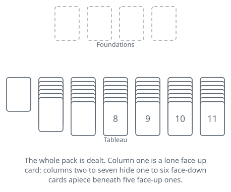
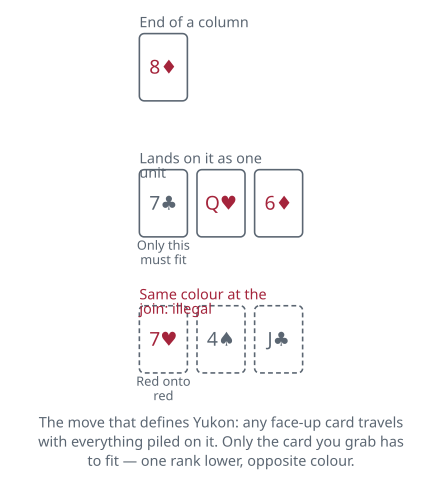

<!-- Generated by packages/build/render-markdown.ts from games/yukon.json. Do not edit by hand. -->

# Yukon

**Also known as:** Yukon Solitaire, Yukon Patience  
**Players:** 1 player  
**Deck:** 1 standard deck (52 cards)  
**Time:** 10-30 minutes  
**Difficulty:** Easy  
**Category:** Solitaire (1 player)  

## Setup

Yukon takes one 52-card deck and rather more table than you expect, because every card ends up in the tableau and the columns grow long.

Begin with a Klondike deal. Lay out seven columns, one card into the first, two into the second, on up to seven into the seventh, all face down, then turn up the last card of each column. That accounts for 28 cards. Now take the 24 still in your hand and deal them face up, four to each of the six columns other than the first, so column one is left exactly as it was: a single card, face up.

Leave four spaces above the tableau for the foundations. They start empty. There is no stock and no waste, since the whole deck is already on the table. Overlap each column enough that every face-up rank stays readable.

## Play

Two kinds of building go on, and only one of them is where the game is decided.

The four foundations rise in suit from the ace: any ace showing at the end of a column may be laid up at once, the 2 of its suit next, and so on to the king. Foundation moves take a single card, and that card has to be the exposed one at the end of a column. The seven columns build downward in alternating colours: a black 7 belongs on a red 8, and a red 6 on that black 7. Ranks do not wrap round in the tableau: a queen goes on a king, but an ace is the bottom of a run and accepts nothing at all.

Now the rule everything turns on. You are not confined to the exposed card of a column. Put a finger on any face-up card anywhere in the tableau, lift it together with every card lying on top of it, and set the whole load down as one unit. The passengers can be in any state at all — out of order, colours repeating, a king riding on a 2 — and none of it matters. The only test is applied to the card you picked up: it has to land on a card one rank higher and of the opposite colour.

Uncovering a face-down card turns it up at once. That is the one thing in Yukon that happens by itself.

An emptied column is reserved for kings. Move in a king by itself, or a load whose bottom card is a king, and nothing else. Emptying a column is hard work in a game with no stock to refill it, so doing it without a king waiting is usually wasted effort.

Most rule sets let you take a card back off a foundation, and with no reserve of any kind to fall back on, that is the kinder default. Only the topmost card of a foundation may come back, it travels alone, and it has to land on a card one rank higher of the opposite colour — or in an empty column, and then only if it is a king. A few rule sets forbid the move outright, so settle which you are playing before you deal.

Nothing is compulsory. Exposed aces may sit where they are, empty columns may stay empty, and a legal move can always be declined in favour of a better one later.

With no stock, there is no rescue. The deal ends when the fourth foundation reaches its king, or when you survey the table and find that no card, alone or loaded, has anywhere legal to go. That second ending arrives more abruptly than beginners expect. Twenty-one of the fifty-two cards start face down, all of them stacked beneath columns you have to dig through, and the freedom to shuffle great heaps of cards around does not help at all once the card you need is at the bottom of one.

## Goal & scoring

The deal is won when all 52 cards have climbed the foundations, ace through king in each of the four suits. Anything short of that is a loss. With no stock and no redeal there is no partial credit and no second run at the same deal.

Traditional play keeps no score at all. Software usually bolts on the Klondike standard system — a credit for each card promoted to a foundation, a credit for each face-down card turned up, a charge for pulling a card back down — or simply runs a clock.

How often Yukon can be won is genuinely unsettled, and the figures in circulation measure two different things while being quoted as though they measured one. The largest published tally, drawn from over half a million recorded games, lands close to 14 in 100 — roughly one deal in seven — which mostly reflects that people abandon awkward deals rather than grind them out. Claims that a patient player takes the large majority of deals are equally common and are not absurd, since only 21 cards are hidden and the rest can be rearranged almost at will. Nobody has run the kind of exhaustive solver study that settled FreeCell, so treat any single headline percentage sceptically and judge yourself across a run of deals instead of one.

## Variants

**Russian Solitaire** — Identical deal and identical freedom to move any face-up card with its whole load, but the tableau builds down in suit rather than in alternating colours. Losing the colour rule removes roughly half of every card's possible destinations, and the result is one of the harder one-deck games. It is the best-known member of the family and worth trying only once ordinary Yukon feels routine.

**Alaska** — The Yukon layout and the Yukon group move, with the tableau built in suit but in either direction: on the 9 of hearts you may place either the 8 or the 10 of hearts. The choice is made afresh at every card and a column is never locked into the direction it started in, so an exposed card will take either of its suit-neighbours, whichever one you still have loose. Being able to run a column upwards as well as downwards buys back some of what the same-suit restriction takes away, which puts Alaska between Yukon and Russian Solitaire in difficulty.

**Moosehide** — The Yukon deal, the Yukon foundations and the Yukon group move, with one change to the tableau: a card builds on any card one rank higher except one of its own suit. The 8 of clubs will go on either red 9 or on the 9 of spades, but never on the 9 of clubs. Three of the four cards of a rank stay open to you where the colour rule leaves only two, so this is the loosest build in the family and a shade kinder than Yukon itself, with Russian Solitaire at the far end. Watch the name: a few rule sets attach it instead to a Yukon deal in which only a proper descending alternating-colour run may be lifted as a group, Klondike style, which is a much harsher game. Check which one your source means before you start.

**Tags:** classic, luck, quick, solo, strategy

*Rules checked against: Wikipedia, BVS Solitaire, Solitaire City, Solitaired, Solitaire Bliss, Solitaire Network, Pure Solitaire.*

---

Part of [Naibi](../README.md). Text licensed [CC BY-SA 4.0](../LICENSE).
